## Overview

Guías prácticas para entornos **sandbox**, **desarrollo**, **producción** y **serverless** con Oracle VirtualBox y Debian Server, cubriendo las distintas configuraciones que se pueden aplicar en cada fase: particionados, LVM, LUKS, tipos de instalación, modos de red y aprovisionamiento con Bash. Cada sección incluye enlaces a páginas de Notion con información más completa y notas técnicas.

Se explica cómo gestionar las máquinas por SSH, cómo funciona el protocolo, el daemon `sshd` y cómo conectar desde VS Code para administrar sistemas remotos.

Todo esto lleva al entendimiento de cómo hacer estos procesos manualmente desde herramientas de **IaC (Infrastructure as Code)**. Esta es la base para entenderlas porque solo son **wrappers** de los procesos que se usan aquí.

---

<p align="center">
  <strong>
    <a href="#-instalacion-de-debian-servers">Debian Server Guide</a> ·
    <a href="#-instalaciones-avanzadas-de-debian-server">Advanced Install</a> ·
    <a href="#-máquinas-virtuales-vms">VMs Guide</a> ·
    <a href="#-configuración-de-red-de-máquinas-virtuales-desde-el-hipervisor">VMs Network</a> ·
    <a href="#-conexion-segura-a-maquinas-con-ssh-daemon-sshd">SSH Guide</a> ·
    <a href="#-guia-para-conectarse-por-ssh-desde-vscode">SSH + VSCode</a> ·
    <a href="#-automatizacion-de-infraestructura-aprovisionamiento-e-iac">IaC</a>
  </strong>
</p>

---

# 🐚 Instalacion de debian servers

Cuando instalamos el SO desde la BIOS del sistema hay varias opciones para hacerlo. Según cuál seleccionamos, la configuración del SO será más específica o menos en la fase de instalación. Por norma general, las cosas que hay que configurar en esta fase, independientemente del tipo de instalación, son:

1. **Localización:** Elige tu idioma, ubicación y distribución del teclado para que el sistema esté correctamente configurado en español.
2. **Red:** Asigna un nombre a tu equipo (hostname). Si estás en una red doméstica, puedes dejar el nombre de dominio en blanco.
3. **Cuentas de Usuario:**
	- Configura la contraseña de `root` (administrador).
	- Crea un usuario personal y su contraseña.
4. **Particionado de Disco:**
	- **Guiado** (recomendado):** El asistente de Debian se encargará de crear las particiones necesarias automáticamente. Es la opción más sencilla y permite opciones como LVM, cifrado, RAID y normal sin complicaciones.
	- **Manual:** Si deseas separar carpetas como `/home` (para tus archivos personales) o `/var` (común en servidores).
5. **Selección de Software:** Debian te preguntará qué escritorio deseas (GNOME, KDE Plasma, XFCE, etc.). Si es para un servidor, selecciona solo "SSH Server" y "Standard system utilities".
6. **Gestor de Arranque (GRUB):** Confirma la instalación de GRUB en tu unidad principal para que el sistema pueda iniciar correctamente.


## Tipos de instalación de debian server
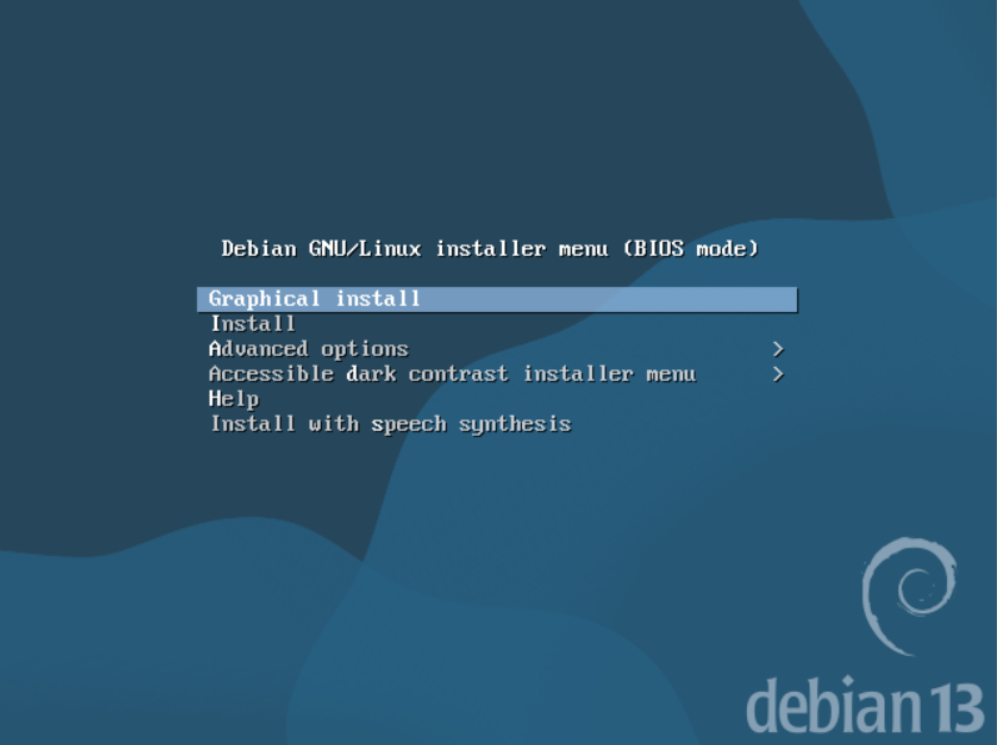

## 🔴 Instalación manual de Debian server

Guia paso a paso con capturas para la instalacion manual desde el menu del instalador.

### 🧭 Vista general del menu de instalación
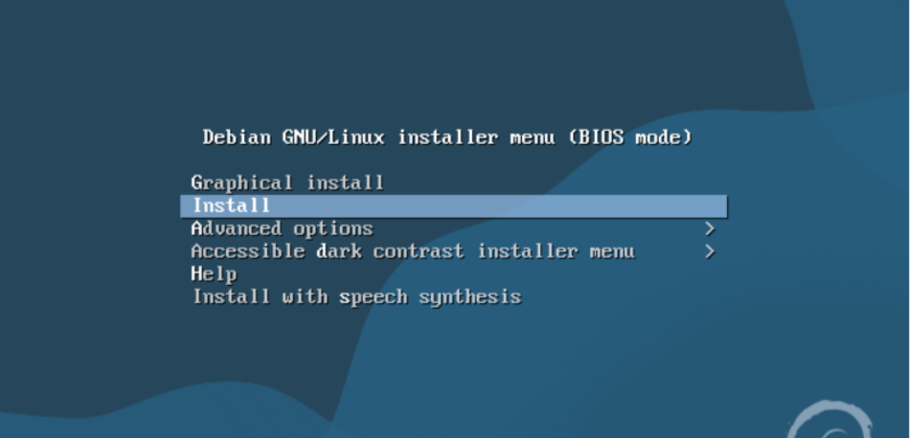

### 📩 Ver pasos desde el menu de instalación
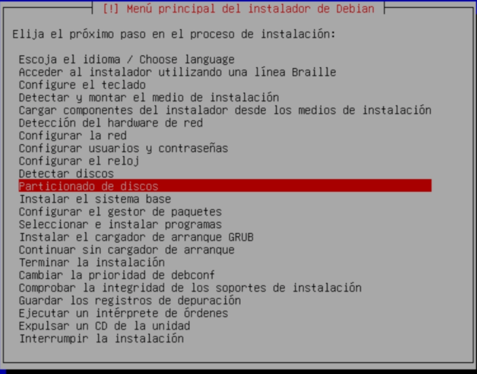

### 1. Idioma y localizacion 🗣️🌎
- **Eleccion de idioma para el sistema:** Selecciona el idioma principal.
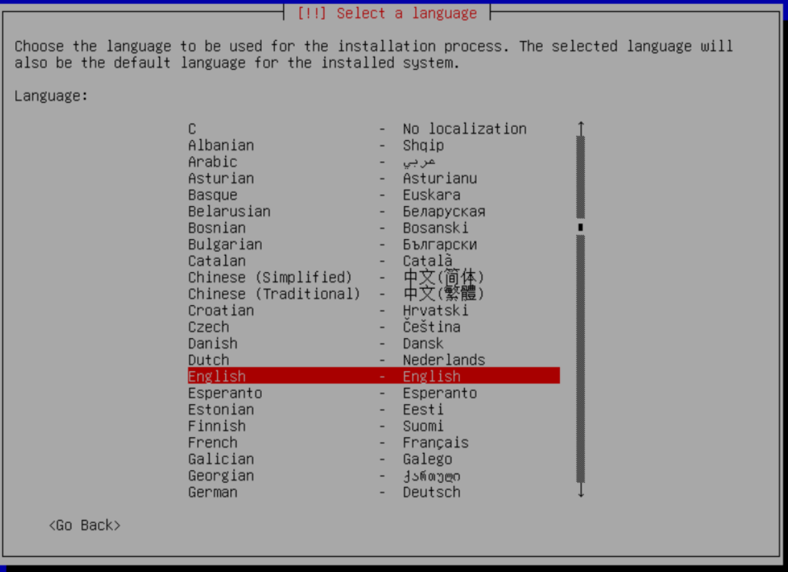
- **Eleccion de localizacion geografica:** Define el pais o region.
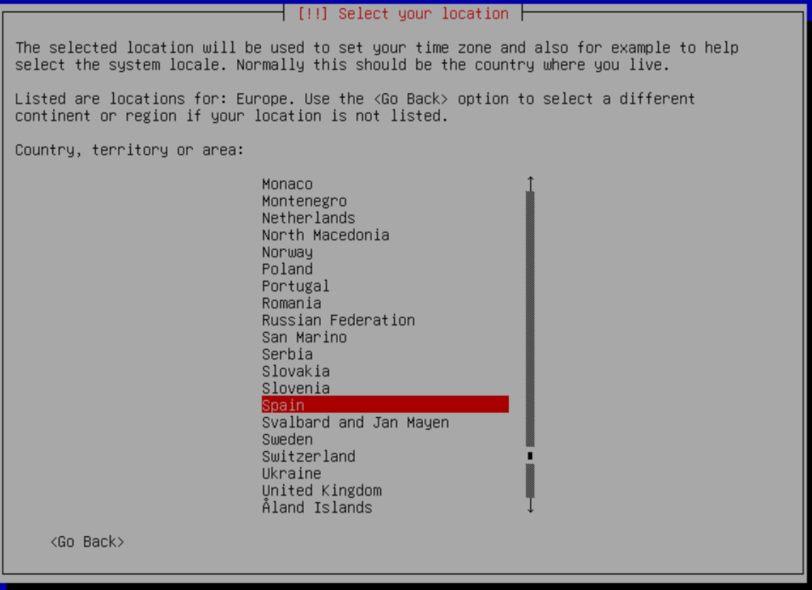

### 2. Teclado ⌨️
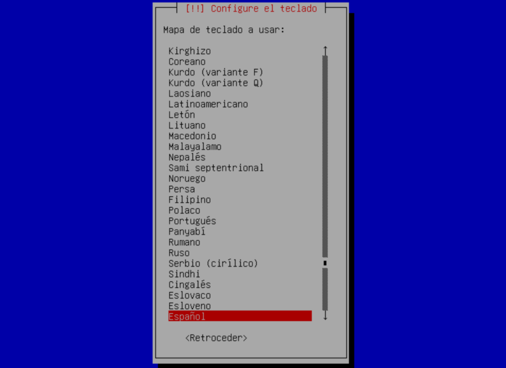

### 3. Red 🌐
Por defecto el instalador detecta interfaces, configura IPv6 y puede usar DHCP.
- **Nombre de la maquina (hostname):** Se guarda en `/etc/hostname`.
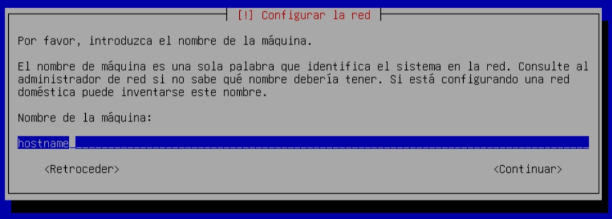
- **Dominio:** Se puede ver con `hostname -d` o `domainname` y en `/etc/hosts`.
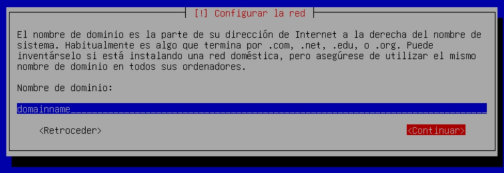

### 4. Usuarios 👮🏻🫂
- **Contraseña de `root`:** Define la clave del superusuario.
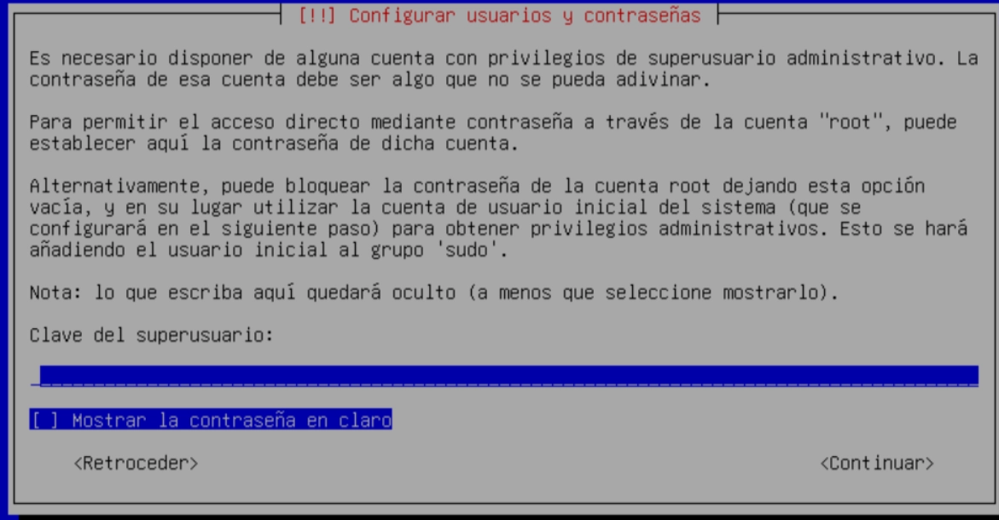
- **Crear usuario sin privilegios:** Usuario normal para el dia a dia.
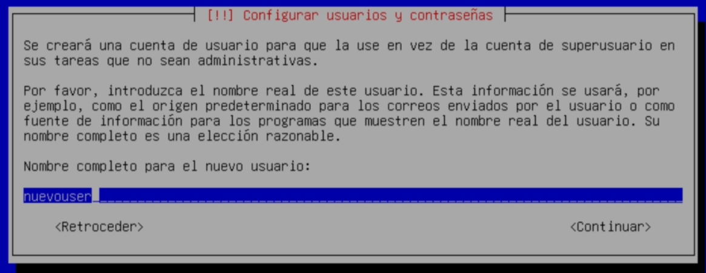
- **Contraseña del usuario normal:** Confirma la clave del usuario.
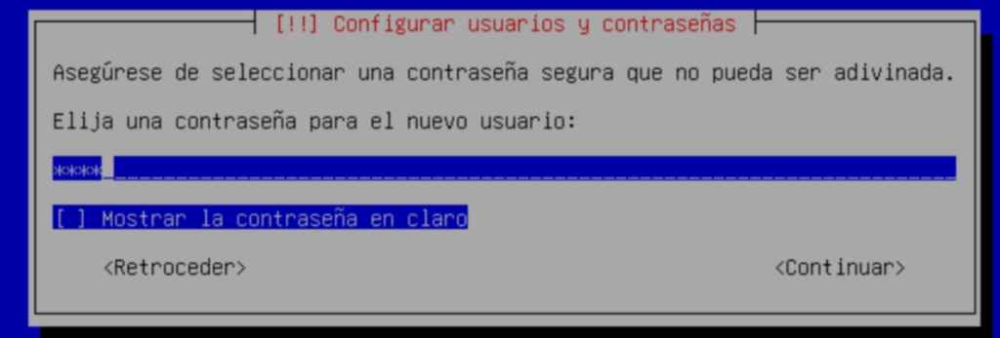

### 5. Zona horaria ⏱️
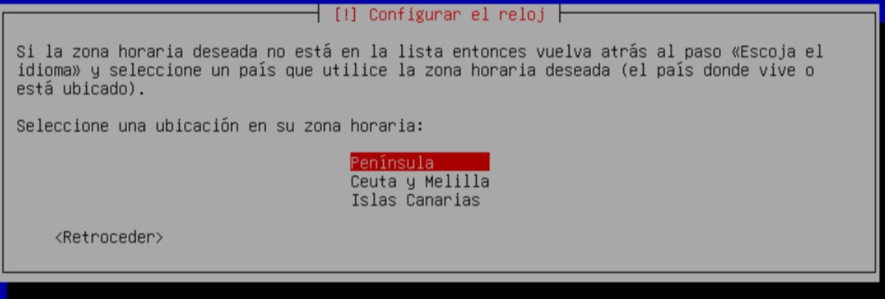

### 6. Detección de discos
Proceso automático; en otros modos se puede ajustar manualmente.

### 7. Particionado de discos 💿💔
- **Seleccion del tipo de particionado:** Define el modo de particionado.
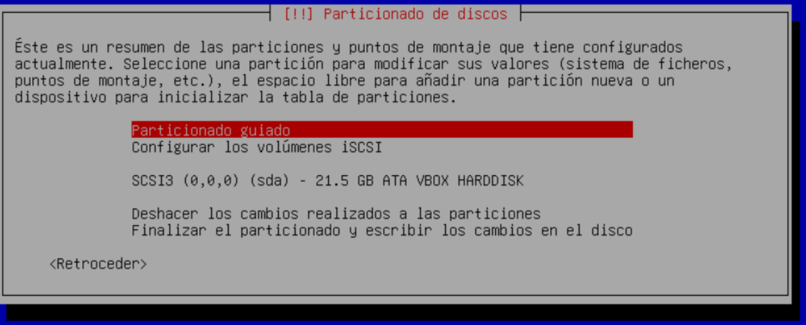

#### 7.1 Particionado guiado
Es la opción "automática" y la más recomendada para la mayoría de escenarios.


> ⚠️ **Critico en servidores de produccion:** En producción se debe usar **LVM (Logical Volume Manager)** porque permite crear grupos de volúmenes dinámicos. Esto es esencial porque los servidores necesitan flexibilidad para crecer: puedes asignar más memoria a una partición cuando se llena sin reiniciar el servicio, conectar discos nuevos y asignar su espacio a las particiones existentes sin interrupción, o quitar memoria de una partición que no esté llena para dársela a otra. Es buena práctica en servidores con alto nivel de carga. Además, existe la opción de usar **LVM cifrado con LUKS** para mayor seguridad: proporciona cifrado a nivel de disco, protegiendo todo el almacenamiento criptográficamente. Sin la contraseña, los datos son inaccesibles aunque alguien tenga acceso físico al disco. Se usa en laptops corporativos y servidores con datos sensibles.

> ℹ️ **Mas información sobre LVM:** Puedes leer más detalles técnicos sobre LVM en:
> [LVM - Logical Volume Manager](https://www.notion.so/LVM-330b80eb3d88803da2b6ffd1d7b1c361)

> ℹ️ **Opciones de particionado guiado:** Información concreta sobre las distintas opciones de esta fase:
> [Configuraciones/modos de particionado de disco](https://www.notion.so/Esquema-de-particionados-guiados-de-Disco-segun-utilidad-y-complejidad-DEBIAN-330b80eb3d888058a98bd7c6959ce581)

- **Elegir tipo de particionado guiado:** Selecciona el asistente deseado.
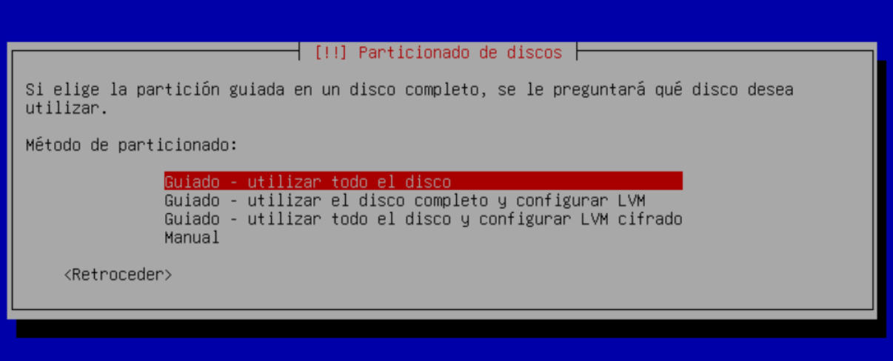
- **Seleccionar disco de destino:** El disco donde se aplicaran los cambios.
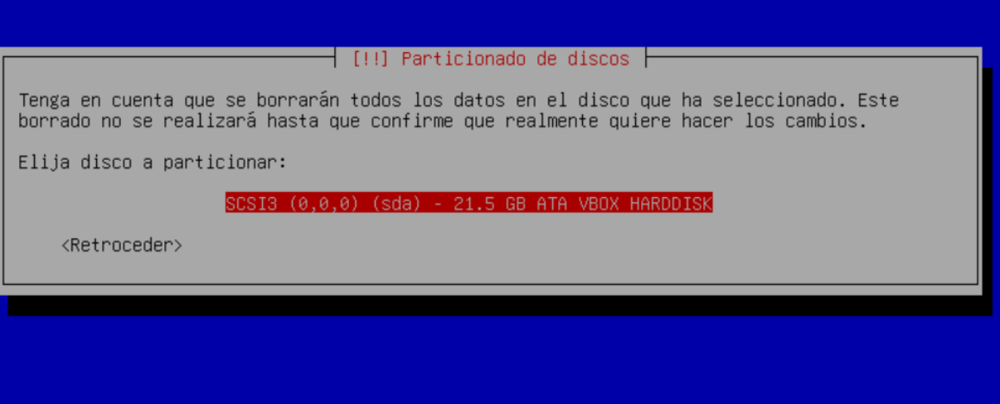

#### 7.2 Esquema de particiones
> ⚠️ **Critico en servidores:** Aqui decides como se particionan los discos logicos. En produccion esto es clave porque los servicios generan logs y datos en carpetas concretas (por ejemplo `/var`). Los logs son registros tecnicos de eventos, errores, auditoria y rendimiento que el servicio y el sistema escriben de forma continua. En produccion los servidores ejecutan funciones de forma iterativa y nos apoyamos en logs y herramientas de observabilidad para monitorizar el comportamiento. Al ser codigo iterativo, el uso de memoria y almacenamiento puede descontrolarse cuando el servidor escala por las peticiones de usuarios u otros factores. Si no separas particiones, un crecimiento de logs puede llenar el disco completo y tumbar el sistema. Con particiones separadas, solo se satura la particion de logs y el servicio puede seguir funcionando. El objetivo es que los limites del sistema no sean el cuello de botella y, si lo son, que el impacto quede aislado y minimo para los usuarios.

> ℹ️ **Guia de esquemas:** Puedes ver los tipos de particiones y sus usos en esta guia de esquemas para servidores:
> [Configuraciones de particiones separadas para servidores](https://www.notion.so/Configuraciones-de-particiones-separadas-para-servidores-330b80eb3d88805a966ff666dca53d01)
- **Elegir el esquema de particiones:** En todos los tipos de particionado guiado hay que pasar por esta sección para elegir el esquema de particiones del disco duro.
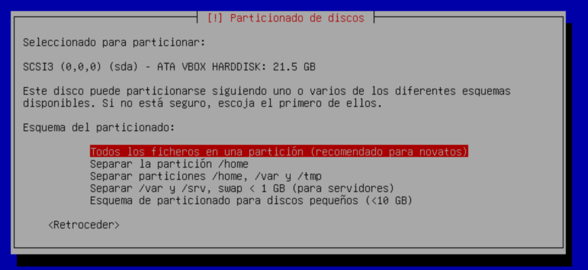
- **Confirmar el esquema:** Se escribe la tabla de particiones en el disco.
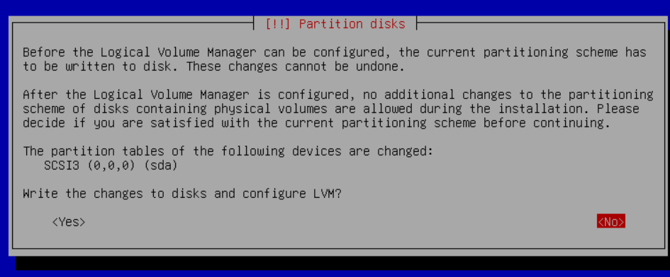

#### 7.3 LUKS (si aplica)
- **Contrasena de cifrado:** En LUKS hay que elegir la contrasena y confirmarla. Si es muy poco segura, se debe volver a poner.
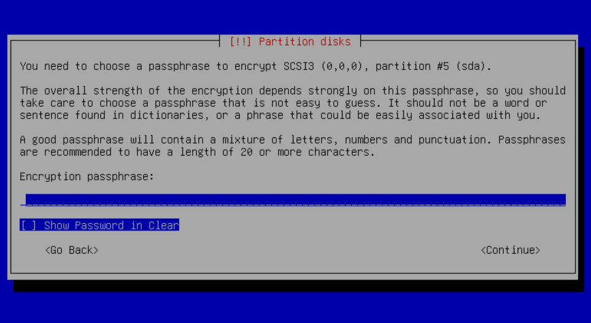

#### 7.4 LVM (si aplica)
- **Parte del disco reservada:** Se recomienda que sea menor que el valor por defecto para que LVM pueda ir añadiendo el disco dinamicamente.
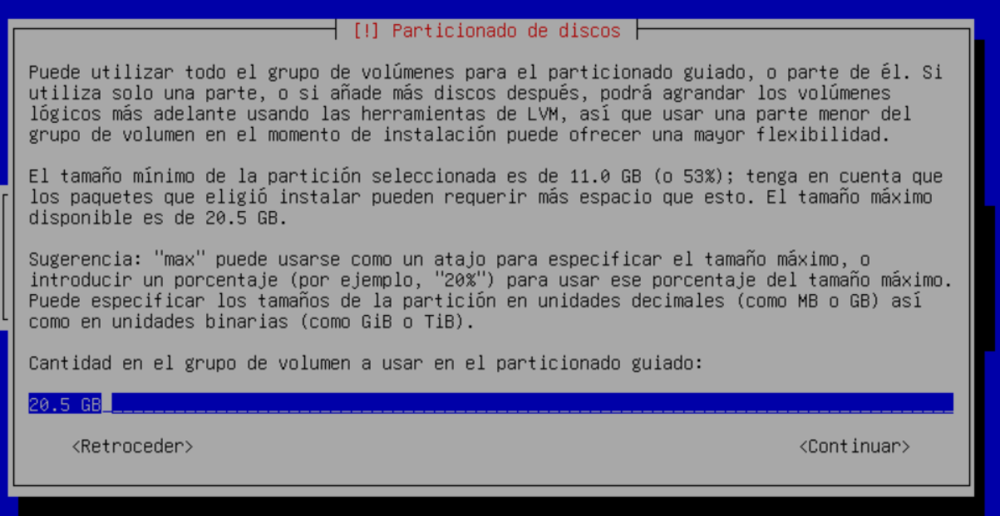

#### 7.5 Revisar y aplicar cambios
- **Resumen de particiones:** Pantalla con las particiones creadas y la opcion de seguir configurando (RAID/LVM) o volver al modo manual. Aqui se confirma el resultado del asistente antes de aplicar cambios.
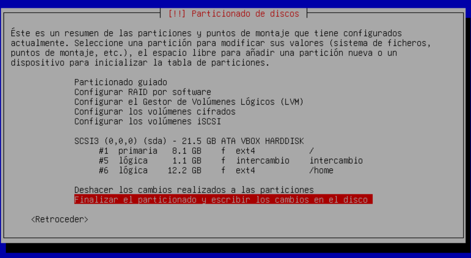
- **Confirmar escritura de particiones:** Se aplican los cambios al disco.
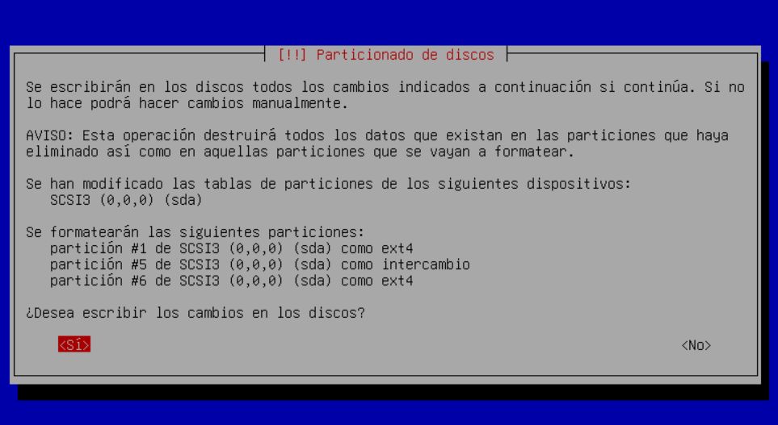

#### 7.6 iSCSI (discos en red)
Opción avanzada de red.
- **Uso:** Permite conectar el sistema a discos remotos expuestos vía red.
- **Motivo:** En servidores de alto rendimiento, el sistema operativo puede residir en una cabina de almacenamiento externa.
- **Cuando conviene:** Solo en entornos empresariales o servidores muy específicos. Para una instalacion normal, se puede ignorar.
- **Entorno:** Centros de datos con redes SAN (Storage Area Network).
- **Ventaja profesional:** Si un servidor fisico falla, el disco virtual vía iSCSI puede conectarse a otro servidor en segundos sin perder datos, clave para alta disponibilidad.

#### 7.7 Particionado manual (SCSI / sda)
- **Para que sirve:** Entrar al particionado manual para crear particiones a medida (por ejemplo, una para el sistema y otra para `/home`).
- **Motivo:** Separa el sistema en "cajones" fisicos. Ejemplos:
	- `/var`: separar logs para que no llenen el disco principal.
	- `/home`: mantener datos de usuarios intactos al actualizar.
	- `swap`: calcular según RAM para picos de carga.
- **Cuando conviene:** Usuarios avanzados o si se quiere conservar datos de otro sistema operativo.
- **Entorno:** Servidores web, correo o sistemas criticos expuestos a Internet.

### 8. Gestor de paquetes y descarga de imagen 💽⚙️
- **Anadir medio USB adicional:** No recomendado salvo necesidad.
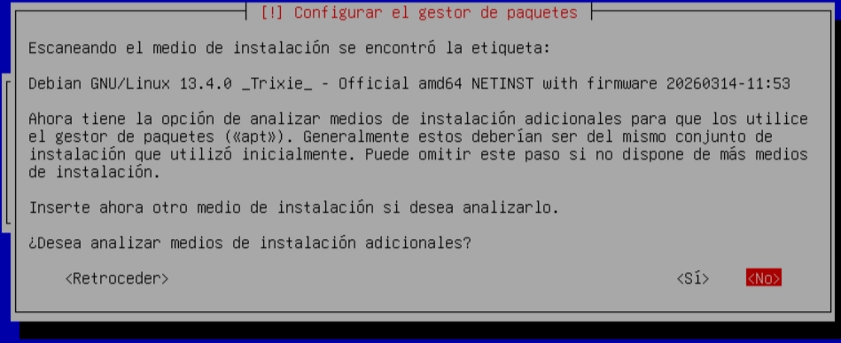
- **Seleccionar region para mirrors de `apt`:** Elige el pais o zona.
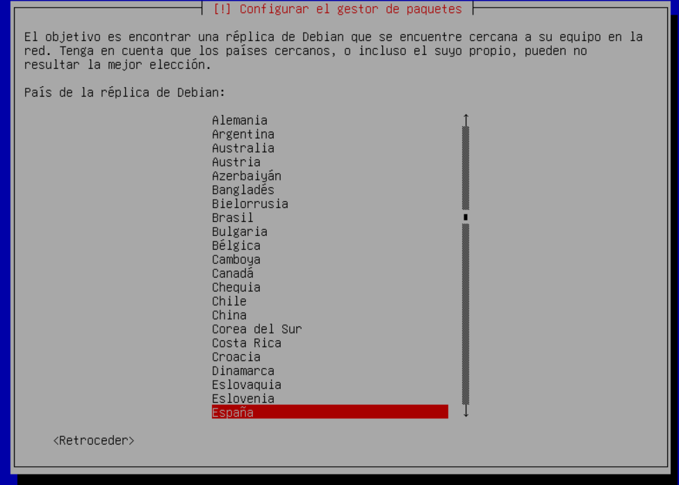
- **Elegir servidor espejo en la region:** Selecciona el mirror mas cercano.
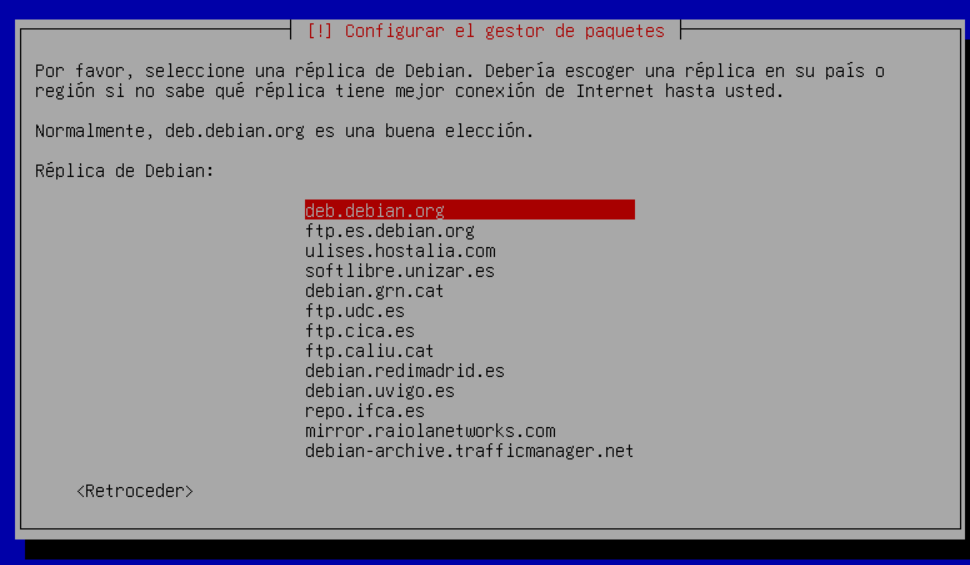
- **Proxy (opcional):** Permite enrutar la conexion al dominio a traves del proxy por razones de seguridad. Se usa mucho en empresas cuando el hostname, el dominio y la red ya estan configurados. Dejar en blanco si no se usa.
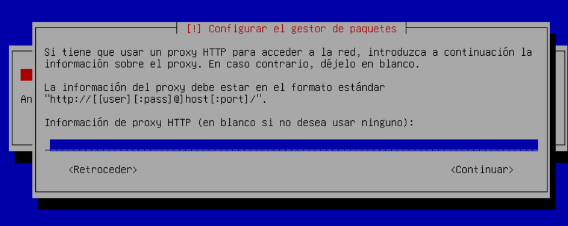

### 9. Selección de paquetes 📦⬇️
**Seleccion de paquetes:** Para marcar o desmarcar usa la tecla espacio. Segun los paquetes que se descarguen, el sistema tendra unas configuraciones u otras. Todo lo que no se descargue aqui se puede instalar luego desde el sistema.
[Paquetes apt en instalacion de debian](https://www.notion.so/330b80eb3d8880d7a400f72a366a3d07)
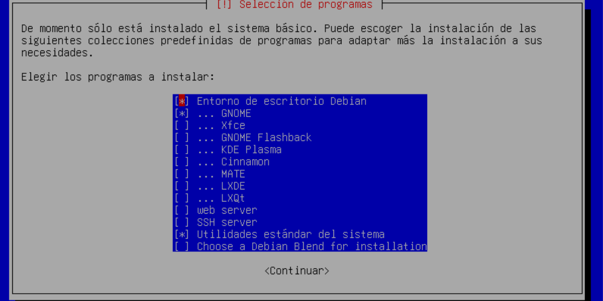

### 10. Instalación de sistema
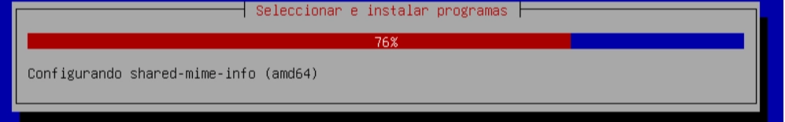

### 11. GRUB 🧩
- **Instalar GRUB:** Importante para gestionar el arranque en VMs o sistemas fisicos. Se puede configurar despues desde el sistema.
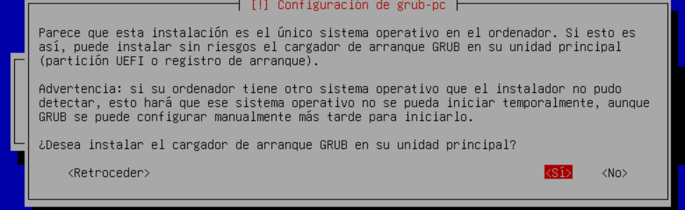
- **Seleccionar disco para el arranque:** Define el disco donde se instala el cargador.
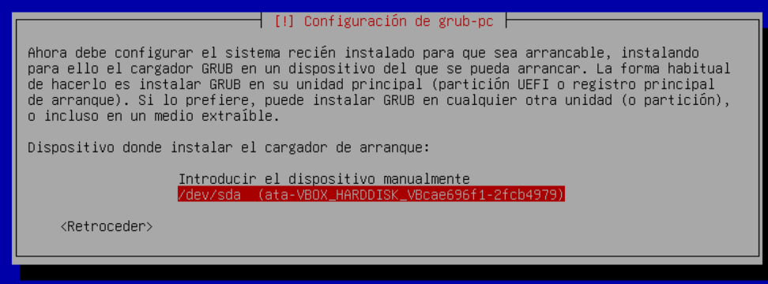

### 12. Instalación finalizada 🥳🥳🥳
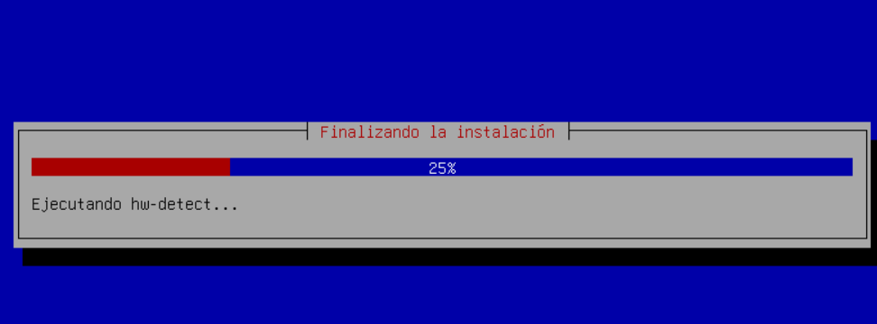
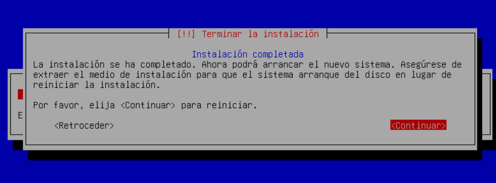


## 🔴 Instalaciones avanzadas de Debian Server

Además de la instalación manual estándar, el menú de arranque del instalador de Debian ofrece otras opciones más avanzadas pensadas para accesibilidad, recuperación, control total o automatización:

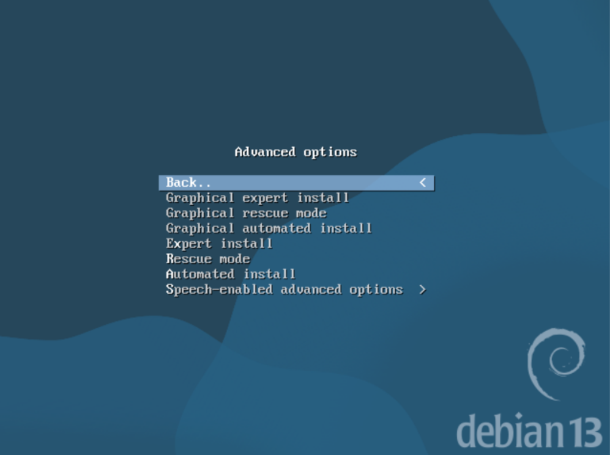

> 📖 **Más información:** Puedes consultar la guía completa con todos los detalles técnicos sobre las instalaciones avanzadas de Debian Server directamente en esta [página de Notion](https://broken-snowdrop-f03.notion.site/Instalaciones-avanazadas-de-debian-server-330b80eb3d8880da8d06d6073d4c69d8). En los siguientes pasos de la guia se tratan por encima.

---

### 🗣️ Speech-enabled (instalación con síntesis de voz)

Versión del instalador diseñada para personas con discapacidad visual. Activa un sintetizador que lee en voz alta las opciones de cada pantalla.

---

### 🛟​ Rescue Mode / Graphical Rescue Mode

No está pensado para instalar, sino para **reparar** un sistema existente. Arranca un entorno mínimo que permite montar el disco y solucionar problemas como:

- Reinstalar el cargador de arranque (**GRUB**)
- Restablecer una contraseña de `root` olvidada
- Reparar errores en el disco o liberar espacio si los logs han llenado la partición

---

### 👨🏽‍⚕️ Expert Install / Graphical Expert Install

Modo con **control total** sobre cada fase de la instalación. A diferencia del modo normal, el instalador no asume nada y expone opciones técnicas que normalmente oculta:

- **Redes complejas:** Configurar VLANs, bonding/teaming de interfaces.
- **Particionado avanzado:** Cifrado LUKS manual, volúmenes LVM con nombres personalizados, sistemas de archivos específicos (XFS, Btrfs, JFS).
- **Selección de kernel:** Elegir versión exacta y módulos del kernel a cargar.
- **Repositorios:** Decidir si habilitar `non-free` o `contrib` durante la instalación.
- **GRUB:** Controlar exactamente dónde y cómo se instala el cargador de arranque.

> ⚠️ **Indicado para administradores con hardware muy específico**, servidores con RAID/LVM avanzado o sistemas ultra-ligeros donde se busca reducir la superficie de ataque.
<div align="center">
	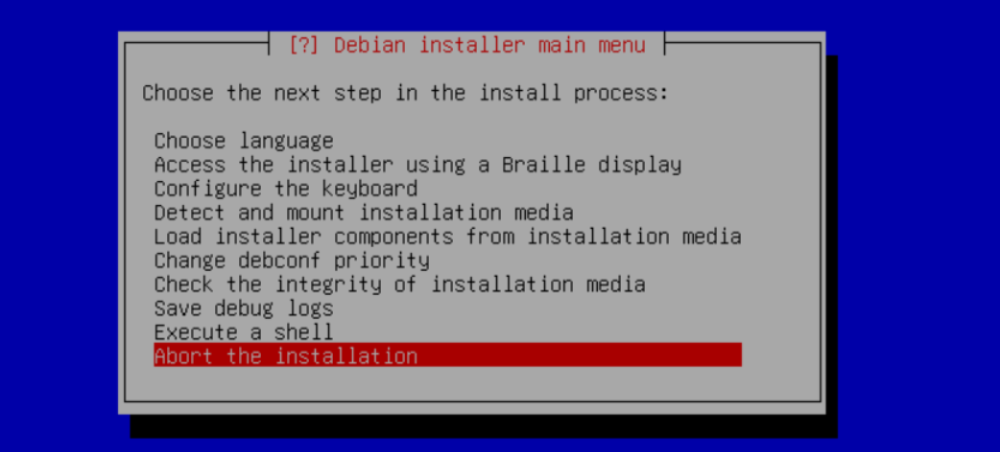
	<br>
	<sup> Interfaz avanzada del instalador donde se exponen los menús de configuración específicos del Modo Experto.</sup>
</div>


---

### ⚙️ Automatic install

Se automatiza el proceso de instalación mediante un archivo que contiene la información y las órdenes del proceso de instalación de Debian Server (`preseed.cfg`).

### Para que se usa el automatic install y el preseed.cfg

> ⚠️ **Instalación desatendida mediante archivo de preconfiguración:** El archivo `preseed.cfg` automatiza la instalación respondiendo de forma nativa a los mismos campos obligatorios que configurarías en una instalación manual de Debian (idioma, teclado, particionado básico, etc.). Este es el mecanismo exacto que activan los hipervisores por debajo cuando seleccionas la opción de instalación desatendida.


> 💡 **Aprovisionamiento avanzado e Infraestructura como Código (IaC):** Más allá de las preguntas básicas, `preseed.cfg` permite inyectar configuraciones críticas del sistema operativo como la gestión de usuarios avanzados, privilegios y llaves criptográficas. Por esta razón, es una pieza fundamental en las tecnologías de automatización y despliegue de infraestructura por código (IaC) para generar plantillas base listas para producción.

<details>
<summary><strong>📋 Ver campos estándar y ejemplo de preseed básico</strong></summary>

Este archivo automatiza las respuestas del asistente estándar de instalación:

* Selección de idioma, país y mapa de teclado.
* Configuración automática de red por DHCP.
* Selección del servidor espejo (*mirror*) oficial de Debian.
* Particionado guiado automático utilizando todo el disco.
* Configuración del cargador de arranque GRUB en el disco principal.

```ini
# Configuración de idioma y teclado
d-i debian-installer/locale string es_ES.UTF-8
d-i keyboard-configuration/xkb-keymap select es

# Configuración de red
d-i netcfg/choose_interface select auto
d-i netcfg/get_hostname string debian-server
d-i netcfg/get_domain string local

# Servidor espejo (Mirror)
d-i mirror/country string manual
d-i mirror/http/hostname string deb.debian.org
d-i mirror/http/directory string /debian
d-i mirror/http/proxy string

# Particionado de disco (Usa todo el disco de forma guiada)
d-i partman-auto/method string lvm
d-i partman-lvm/device_remove_lvm boolean true
d-i partman-md/device_remove_md boolean true
d-i partman-auto/choose_recipe select atomic
d-i partman-partitioning/confirm_write_new_label boolean true
d-i partman/choose_partition select finish
d-i partman/confirm boolean true
d-i partman/confirm_nochanges boolean true

# Arranque GRUB
d-i grub-installer/only_debian boolean true
d-i grub-installer/bootdev string default
d-i finish-install/reboot_in_progress note
```
</details>

<details>
<summary><strong>🚀 Ver configuraciones avanzadas y ejemplo de despliegue automatizado</strong></summary>

Este bloque de configuración automatiza elementos avanzados del sistema listos para ser gestionados por herramientas de configuración posterior (como Ansible):

* Creación de un usuario administrador con privilegios en `sudo`.
* Instalación nativa del servidor OpenSSH y un servidor web HTTPS (Nginx).
* Inyección automatizada de una llave pública SSH para acceso sin contraseña.
* Configuración de seguridad inicial en el demonio `sshd`.

```ini
# Configuración de cuentas (Root desactivado, creación de usuario con sudo)
d-i passwd/root-login boolean false
d-i passwd/user-fullname string Administrador de Sistemas
d-i passwd/username string sysadmin
d-i passwd/user-password-crypted password $6$rounds=40000$saltstring$hashedpassword_here
d-i passwd/user-default-groups string sudo admin cdrom

# Selección e instalación automatizada de paquetes (Servicios base)
d-i pkgsel/include string openssh-server sudo nginx curl CA-certificates
d-i pkgsel/upgrade select safe-upgrade

# Comando tardío (Late Command) para inyectar configuración post-instalación
# Aquí se crea el directorio .ssh, se añade la clave pública y se levanta el servicio HTTPS
d-i preseed/late_command string \
    in-target mkdir -p /home/sysadmin/.ssh; \
    echo "ssh-ed25519 AAAAC3NzaC1lZDI1NTE5AAAAIJuYourPublicSSHKeyHere sysadmin@provision" > /target/home/sysadmin/.ssh/authorized_keys; \
    in-target chown -R sysadmin:sysadmin /home/sysadmin/.ssh; \
    in-target chmod 700 /home/sysadmin/.ssh; \
    in-target chmod 600 /home/sysadmin/.ssh/authorized_keys; \
    in-target systemctl enable ssh; \
    in-target systemctl enable nginx
```

> ⚠️ En entornos reales las contraseñas no se ponen en texto plano, se usan **hashes**. Un solo error en el nombre de una variable hará que el instalador se detenga en esa pantalla.

</details>

### Donde se guarda el archivo `preseed.cfg` para la instalación desatendida

El instalador solicita la ruta exacta donde se encuentra localizado este archivo para poder descargarlo:

* **Ruta no local:** A través de un servidor web remoto en la red utilizando el protocolo HTTP (`http://...`).
* **Ruta local:** Apuntando directamente al archivo guardado dentro del propio medio de almacenamiento o USB físico (`file://...`).

<div align="center">
	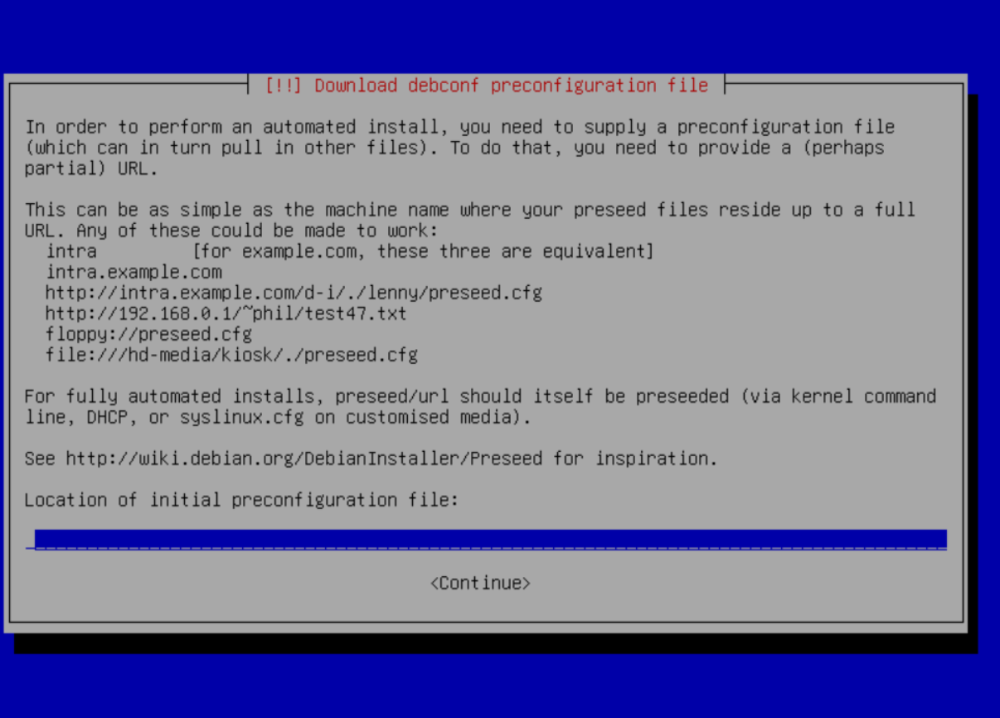
	<br>
	<sup>Proceso de carga de la instalación desatendida y automatizada desde el entorno del hipervisor.</sup>
</div>


<br>
<br>


# 🦝 Máquinas Virtuales (VMs)


Un hipervisor es una capa de abstracción que virtualiza los recursos del hardware (CPU, memoria, almacenamiento, dispositivos de red) del host, permitiendo crear máquinas virtuales independientes con sus propios kernels y sistemas operativos, aisladas entre sí a nivel de software.

### Usos principales

- **Desarrollo:** Crear entornos aislados (**hardering**) que nos permitan testear software en distintos SO. También para probar software de terceros de manera segura mediante **sandboxing**, de forma que si algo pasa no se contamina nuestro ordenador.

- **Producción:** En entornos de producción, los IAAS y los servicios de hosting usan máquinas virtuales para alojar muchos servidores distintos sin riesgo de que el servidor principal que las aloja sufra daños. Además, gracias a la escalabilidad y flexibilidad, se pueden **asignar recursos de manera dinámica** (infraestructura) y **automatizar despliegues** (DevOps automation).

- **Servicios públicos:** Exponer servicios al público con riesgo aislado.

- **Laboratorio y múltiples SO:** Creación de laboratorios de red o simplemente para tener múltiples sistemas operativos dentro de un ordenador sin necesidad de hacer particiones de disco duro.

> ℹ️ **Más información sobre VMs e hipervisores:** Si quieres profundizar en los usos específicos, tecnologías de hipervisores de escritorio y servicios remotos, puedes consultar:
> [¿Qué es una VM, el hipervisor y principales tecnologías?](https://www.notion.so/Que-es-una-Vm-el-hipervisor-y-proncipales-tecnologias-357b80eb3d8880948fafdfbbbd22fe1d)

---

## 🖥️ Creación y configuración de la VM desde el hipervisor

### Crear VMs a través del hipervisor (manual)

A la hora de crear la máquina virtual de VirtualBox desde la interfaz del programa tenemos varias opciones para hacerlo. Lo primero es seleccionar la opción de crear máquina. Una vez seleccionada se abrirá una nueva pestaña donde podremos elegir:

---

### 1. Configurar nombre de la máquina, localización en el host e ISO

- **Nombre de la máquina**
- **El directorio del sistema** donde se encontrará alojada
- **La ISO del sistema operativo** que va a usar la máquina (tendremos que tenerla descargada en nuestro sistema)

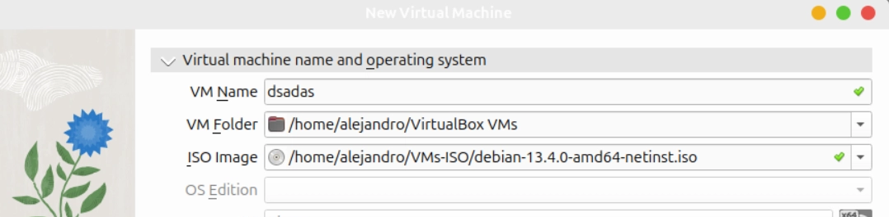

---

### 2. Configurar especificaciones de arquitectura de sistema operativo

> ⚠️ Estos campos solo hay que configurarlos manualmente si se elige la instalación manual (desatendida)

- **Elección de sistema operativo (OS)**
- **Elección de distribución OS**
- **Elección de versión de sistema (arquitectura)**


---

### 3. Configurar especificaciones de hardware virtualizado para la máquina

> ⚠️ Estas configuraciones hay que configurarlas independientemente del tipo de instalación (atendida o desatendida)

Son las configuraciones de los núcleos de CPU, la RAM y la memoria en el disco que va a asignar el hipervisor de nuestro sistema a la máquina cuando esté encendida (funcionando):

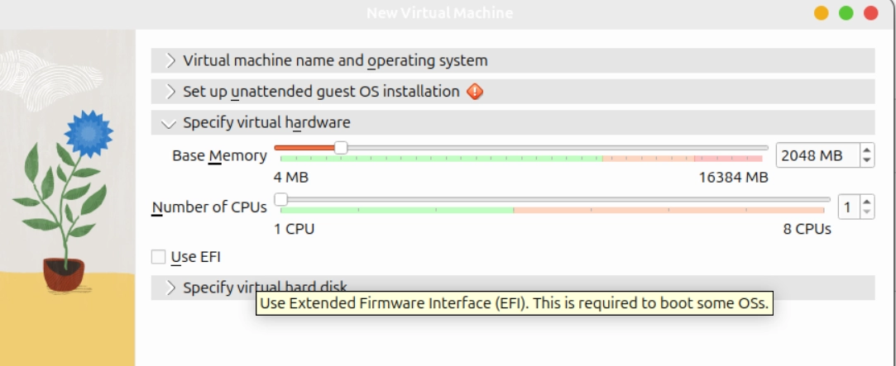

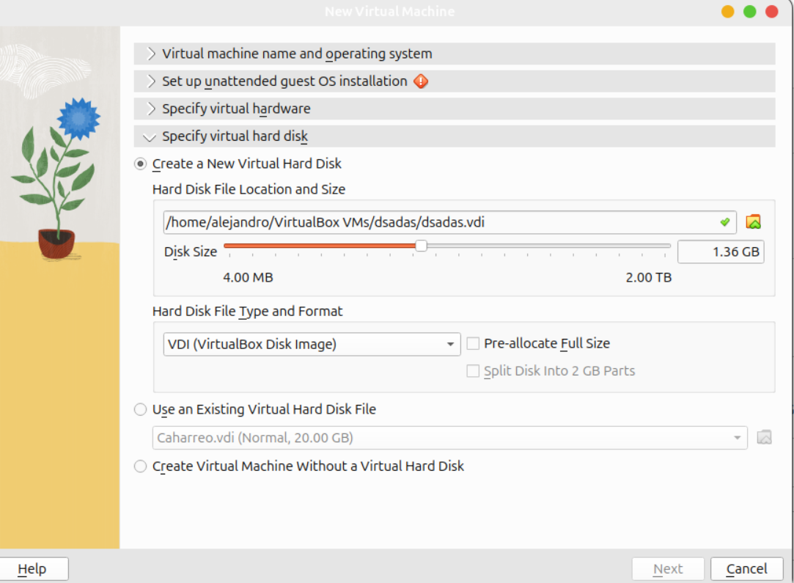

---
## 🔧 Tipos de instalación

### 1. Instalación desatendida

Tendremos que configurar varias cosas desde el hipervisor. La instalación manual se tendría que hacer en el proceso de instalación del sistema:
- **Nombre de usuario principal**
- **Contraseña de usuario**
- **Claves de sistema operativo** (para Windows)

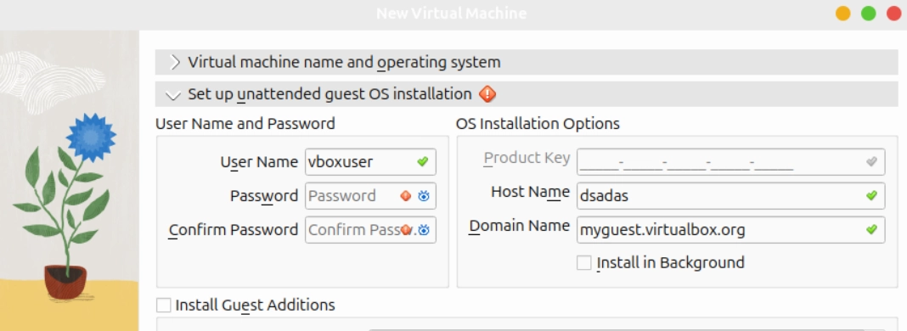

Por otra parte, el resto de la instalación y configuración del sistema se hace automáticamente. Le damos a "finish" y comienza: descarga de paquetes, elección de software, etc. Cuando acabe la instalación solo tendremos que loguearnos y ya estaremos dentro de un sistema operativo preconfigurado.

---

### 2. Instalación manual

Después de los pasos previos, le damos a "finish" y comienza la instalación del sistema operativo manualmente. Según el proceso de instalación de cada sistema se hará de una manera u otra. Este modo nos da mucho más manejo sobre cómo queremos que esté instalado nuestro sistema.

---

## 🌐 Configuración de red de máquinas virtuales desde el hipervisor

Cuando creas una maquina virtual desde el hipervisor puedes elegir que modo de Red quieres usar para concestar las Vms con la Red. Segun el modo de de seleccionado el comportamiento interno de la Red, el alcanace, la forma de conctar con el host (servidor) y con elxterior que est ajecutando el hipervisor es distinta y cada uno esta destinado a un uso diferente. Por defecto las maquinas virtuales cuando se crean desde el hipervisor manualmete se crean en modo NAT.

<h4 align="left">Tipos de red disponibles en VirtualBox</h4>
<p align="left">
  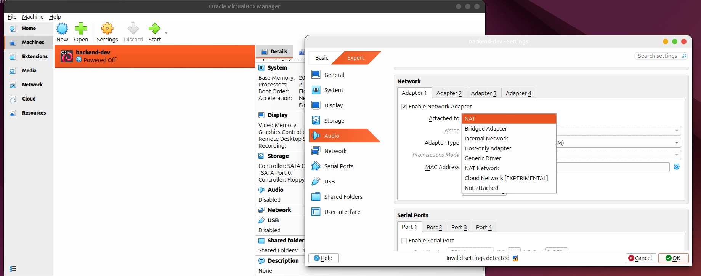
</p>

---

### Modo NAT (Network Address Translation)

El hipervisor gestiona su propia red interna a través de sus **tablas de NAT internas** y sus **tablas de PAT** (Port Address Translation). Además, actúa como **servidor DHCP**, asignando dinámicamente direcciones IP a las máquinas virtuales y proporcionando la puerta de enlace (gateway) por defecto para poder conectarse a redes fuera de su LAN

> ⚠️ El trafico de red siempre sale con la IP del host. Por lo que no la maquina virtual no es visibles desde el host ni desde fuera del host.

> ⚠️ **No se recomienda este modo para servidores en produccion:** Si quieres crear un servidor en la VM, como no es visible desde fuera (comparte IP con el host), debes configurar **port forwarding en el hipervisor** para que el host o clientes externos puedan conectarse a la VM, redirigiendo un endpoint del host (IP + puerto) a un endpoint de la VM (IP + puerto). Por lo que publicamente tendrias que usar la direccion del host para que los clientes se conecten a tu servidor, por eso no se recomienda este modo para servidores en producción.
 

<details>
<summary><strong>Explicación del modo NAT y port forwarding</strong></summary>


El hipervisor gestiona su propia red interna a través de sus **tablas de NAT internas** y sus **tablas de PAT** (Port Address Translation). Además, actúa como **servidor DHCP**, asignando dinámicamente direcciones IP a las máquinas virtuales y proporcionando la puerta de enlace (gateway) por defecto para poder conectarse a redes fuera de su LAN.

<h4 align="left">Asignacion DHCP dentro del modo NAT</h4>
<p align="left">
  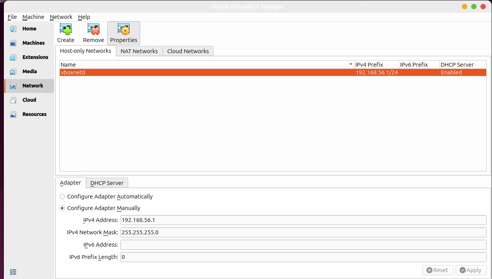
</p>

Por defecto, todo el tráfico que sale de la VM hacia Internet **sale con la IP del host** (servidor) y el puerto que el hipervisor reserva dentro del host para abrir un socket y comunicarse con el exterior. Esto se hace gracias al **NAT interno** del hipervisor que, cuando recibe una respuesta de Internet, traduce la IP del host y el puerto del host al puerto y la IP de la VM que hizo la petición. Las entradas de la tabla de traducción NAT son efímeras y solo sirven para comunicarse como cliente con el exterior, no para exponer servicios al exterior.

La manera de poder exponer servicios al exterior con este modo de red es a través de la **configuración de reglas de PAT** (Port Address Translation) en el hipervisor. Como la VM no tiene IP visible desde el host ni desde fuera del host, no podemos generar endpoints para que los clientes de un servidor alojado en ella se conecten. Con estas reglas lo solucionamos asociando un puerto endpoint del host (IP + puerto) a un endpoint de la VM (IP + puerto). Con esto podemos redirigir y controlar quién puede conectarse con la VM, actuando también como firewall para controlar el acceso a los servicios alojados en la VM.

<h4 align="left">Redireccion de puertos desde el hipervisor</h4>
<p align="left">
  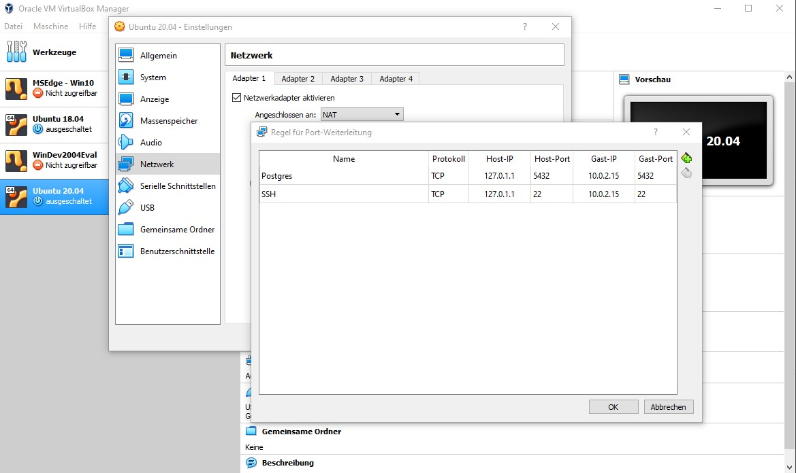
</p>

> ℹ️ **Más información sobre modo NAT en hipervisores:** Si quieres profundizar en el funcionamiento de estas tecnologías en el contexto de los hipervisores, puedes consultar:
> [NAT, PAT y DHCP en hipervisores](https://broken-snowdrop-f03.notion.site/Modo-NAT-y-Port-forwarding-32db80eb3d8880dc922fea99a4f7a1e0)

</details>

---

### Modo Bridge (Adaptador Puente)


En modo Bridge, la VM tiene entidad propia de red (IP y MAC). Esto permite que sea visible desde fuera del host y desde el propio host como un dispositivo independiente.

> ⚠️ **Uso para servidores en producción**: Si quieres crear un servidor en la VM, este modo es el recomendado porque la VM es visible desde fuera y no necesitas configurar port forwarding para que los clientes se conecten a tu servidor. Al tener un endpoint propio es visible y accesible por otros dispositivos de la red local y de Internet, lo que es ideal para servidores en producción. Además, el router puede asignar direcciones IP dinámicamente a la VM mediante DHCP.

> ⚠️ **Necesita de medidas de seguridad perimetrales fuera del host** :(firewalls, IDS/IPS, etc.) para proteger la VM, ya que al ser visible en la red, es susceptible a ataques externos. Debido a que lo paquetes no pasan por la pila de red del host y este no puede controlar el trafico por lo que es vulnerable a ataques externos.VM.


<details>
<summary><strong>Explicacion de modo Bridge</strong></summary>

En modo Bridge, la VM tiene entidad propia de red y de dirección MAC. Esto permite que sea visible desde fuera del host y desde el propio host como un dispositivo independiente. El hipervisor conecta la vNIC de la VM a la interfaz física del host mediante un mecanismo de bridge o switch virtual. Aunque el tráfico sale físicamente por la NIC del host, las tramas Ethernet conservan la MAC de la VM, por lo que la máquina virtual aparece en la red como un dispositivo independiente a nivel de capa 2, permitiendo que reciba tramas dirigidas a su propia MAC, además de la del host. Así, los paquetes de red no tienen que ser desempaquetados por la pila de red del host ni redirigidos mediante port forwarding.

**Esto tiene ventajas e inconvenientes:**
 - La **ventaja** es que, al ser visible como un dispositivo independiente, la VM puede comunicarse directamente con otros dispositivos en la red local y con Internet sin necesidad de configurar reglas de port forwarding y que el tráfico no tenga que pasar por la pila de red del host y se enrute por la MAC de la VMS **disminuye la latencia**. Esto es importante porque ciertos protocolos de comunicación, como VoIP o protocolos de descubrimiento, no funcionan bien con la latencia añadida por NAT o port forwarding.  Ademas se puede configurar la VM para que reciba una dirección **IP dinámica del router mediante DHCP**.

- El **inconveniente** es que, al estar en modo bridge, el tráfico se enruta directamente desde la MAC de la VM sin pasar por la pila de red del host, por lo que n**o se le pueden aplicar reglas de firewall desde el host**. Esto implica que la máquina queda totalmente expuesta a Internet si se crea un servicio, sin ningún tipo de protección, lo que la hace **vulnerable**.

> ℹ️ **Más información sobre modo Bridge en hipervisores:** Si quieres profundizar en el funcionamiento, ventajas, riesgos y configuraciones avanzadas del modo Bridge, consulta:  
> [Modo Bridge en hipervisores](https://broken-snowdrop-f03.notion.site/Modo-Bridge-32db80eb3d8880799d97db06c5ca2eb8?pvs=74)


</details>

<details>
<summary><strong>Explicacion breve de aqrquitecturas con modo Bridge</strong></summary>

Como hemos dicho antes el modo bridge tiene la ventaja de que la VM es visible desde fuera del host y no necesita reglas de port forwarding para exponer servicios al exterior, pero tiene la desventaja de que el tráfico no pasa por la pila de red del host y este no puede controlar el tráfico, lo que hace a la VM vulnerable a ataques externos.


Por ellos simpre se tiene que configurar con **memedias de seguridasd perimetrales** fuera del host **(firewalls, IDS/IPS, etc.)**. Se suele pasar el tráfico antes por **una DMZ (zona desmilitarizada)**, suele ser un servidor o maquina que hace de router con reglas de firewall para controlar el acceso a la VM y protegerla de ataques externos.

En infraestructuras de **IaaS (cloud), hosting y servidores de alta disponibilidad** se suele usar este modo para alojar los servidores en producción. Además del servidor con el enrutamiento, se suele aprovechar y **se acompaña de VLANs** para segmentar la red y aislar los servidores entre sí, de **balanceadores de carga** para distribuir el tráfico entre varios servidores y mejorar la disponibilidad y el rendimiento Y de mecanismos de **micro-segmentación** para controlar el tráfico entre servidores y limitar el alcance de posibles ataques internos.

> 💻 **Repositorio con explicaciones y referencias sobre este modo:**  
> [Inception - Ejemplo de infraestructura y automatización con VMs (GitHub)](https://github.com/alcarril/Inception)


</details>


</details>

<details>
<summary><strong>Extra modo promiscuo en hipervisores (IDS/IPS, sniffer, Monitorización)</strong></summary>

Normalmente, una tarjeta de red es "educada": si llega una trama cuya MAC de destino no corresponde con la suya, la descarta a nivel de hardware para no pasar tráfico innecesario a la CPU. En modo Bridge, aunque varias VMs puedan compartir la misma interfaz física del host, el hipervisor ya se encarga de entregar a cada vNIC las tramas que corresponden a su MAC.

Al activar el modo promiscuo, se permite que una interfaz o una VM reciba también tráfico que no va dirigido específicamente a su propia MAC. Dicho de forma simple, le dices a la tarjeta o al switch virtual: "pásame también tráfico que normalmente descartarías". Esto es útil para:

- **IDS/IPS (Intrusion Detection/Prevention Systems):** Para detectar ataques o comportamientos sospechosos en la red, el IDS necesita ver todo el tráfico. En modo promiscuo, puede analizar cada paquete que pasa por la red, incluso si no está dirigido a la VM, lo que es esencial para detectar amenazas.
- **Sniffer de red:** Herramientas como Wireshark o tcpdump necesitan el modo promiscuo para capturar todo el tráfico de la red y analizarlo, lo que es crucial para troubleshooting, análisis forense o auditorías de seguridad.
- **Monitorización de red:** Para monitorizar el rendimiento, detectar cuellos de botella o analizar patrones de tráfico, el modo promiscuo permite a la VM recoger datos de toda la red, no solo de su propio tráfico, lo que proporciona una visión completa del entorno de red.


> ℹ️ **Más información sobre configuración de modo promiscuo en hipervisores:** Consulta detalles técnicos, ejemplos y usos avanzados aquí:  
> [Configuración de modo promiscuo en hipervisores](https://broken-snowdrop-f03.notion.site/Configuracion-de-modo-promiscuo-357b80eb3d888080a57fe84461f70488?pvs=74)


</details>

---

### Modo Host-Only


En modo Host-Only, la VM solo puede comunicarse con el host y con otras VMs en la misma red Host-Only. No tiene salida directa a Internet (salvo que se combine con un segundo adaptador de red).

> ⚠️ **Solo para pruebas cerradas y entornos controlados (sandbox):** Este modo es ideal para entornos de pruebas cerrados, análisis de malware en sandbox controlado o laboratorios donde no se necesita conexión a Internet. Al no tener acceso a la red externa, las VMs están completamente aisladas del mundo exterior, lo que las hace seguras para probar software potencialmente peligroso sin riesgo de comprometer el host o la red real.

<details>
<summary><strong>Como funciona el modo Host-Only</strong></summary>

El hipervisor crea una interfaz de red virtual (por ejemplo, ***vboxnet0*** en VirtualBox o ***VMnet1*** en VMware) que solo conecta el host y las VMs configuradas en modo Host-Only. Esta interfaz tiene su propia subred y actúa como un switch virtual aislado. Las VMs pueden comunicarse entre sí y con el host, pero no pueden acceder a Internet ni a la red física del host.

**Como el hipervisor para aislar la interfaz de red de internet**
- No hay Gateway configurado: la VM no sabe a dónde enviar el tráfico externo.
- El switch virtual está aislado: solo conecta VMs y host, no sale a Internet.
- El host no reenvía tráfico (IP Forwarding desactivado): aunque pongas su IP como gateway, no actúa como router.


> ℹ️ **Más información sobre modo Host-Only en hipervisores:** Consulta detalles técnicos, ejemplos y usos avanzados aquí:  
> [Modo Host-Only en hipervisores](https://broken-snowdrop-f03.notion.site/Modo-Host-only-32db80eb3d8880368af2f084afd5ee80?pvs=74)
</details>

---

### Modo Internal Network (Red Interna)


En modo Internal Network, las VMs solo se comunican entre ellas dentro de una red virtual interna del hipervisor. Ni el host ni la red física tienen acceso directo a esa red.

> ⚠️ **Máximo aislamiento para escenarios multi-VM (netlabs, microservicios en testing):** Este modo es ideal para simular topologías de red complejas (cliente-servidor, DMZ, segmentación por subredes y laboratorios de red) sin ningún impacto en la red real. 

<details>
<summary><strong>Como funciona el modo Internal Network</strong></summary>
El hipervisor crea una red virtual completamente aislada (por ejemplo, ***intnet*** en VirtualBox) a la que solo pueden conectarse las VMs configuradas en modo Internal Network. El hipervisot hace DHCP interno para asignar IPs a las VMs y DNS interno para resolver nombres entre ellas.

> 	 **Más información sobre modo Internal Network en hipervisores:** Consulta detalles técnicos, ejemplos y usos avanzados aquí:  
> [Modo Internal Network en hipervisores](https://broken-snowdrop-f03.notion.site/Modo-Internal-Network-32db80eb3d88806eaeffcd0836cdade9?pvs=74)

</details>

---

## 🧩 Configuraciones extras de Hipervisores para VMs

A continuacion tienes utilidades practicas de VirtualBox en formato desplegable.


<details>
<summary><strong>Localizacion de maquinas en VirtualBox</strong></summary>

Explica donde se guardan las VMs y como cambiar la ruta por defecto desde la configuracion global.

<h4 align="left">Preferencias de ubicacion de VMs</h4>
<p align="left">
  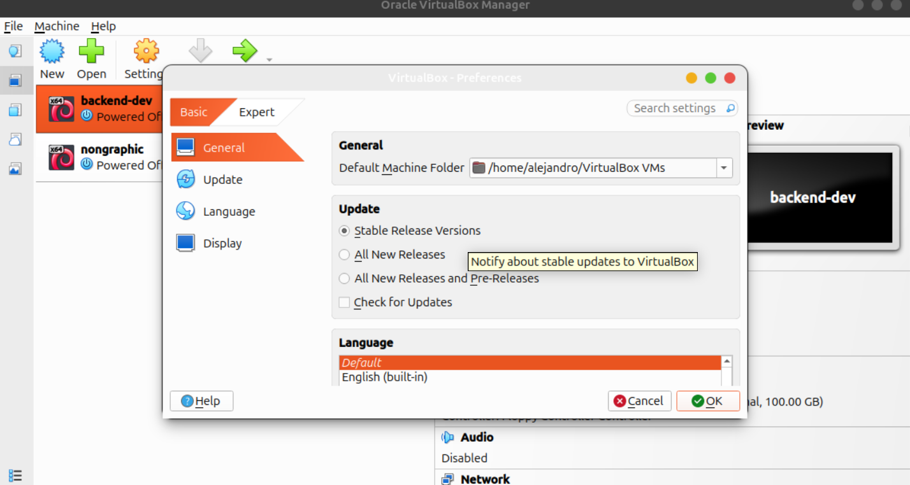
</p>

> ℹ️ **Mas informacion sobre ubicacion de VMs:**
> [Localizacion de maquinas de VirtualBox](https://www.notion.so/330b80eb3d8880e0a545f401bd38d079)

</details>

<details>
<summary><strong>Snapshots en VirtualBox</strong></summary>

Las instantaneas permiten volver a un estado anterior de la VM para pruebas, actualizaciones o recuperacion rapida. Congelan:
- El **estado del disco** (todos los archivos, sistema operativo, programas...)
- El **estado de la memoria RAM** (si la VM esta encendida)
- La **configuracion de la maquina virtual**

Se pueden crear desde la interfaz grafica (imagen inferior).

<h4 align="left">Crear una snapshot desde VirtualBox</h4>
<p align="left">
  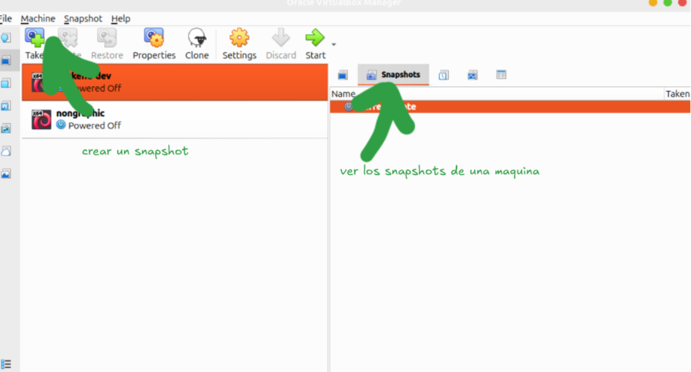
</p>

**Cambiar ubicacion por defecto y consultar donde se guardan**
Desde la configuracion de la VM puedes definir el directorio por defecto de snapshots y ver su ruta actual.

<h4 align="left">Cambiar ubicacion de snapshots</h4>
<p align="left">
  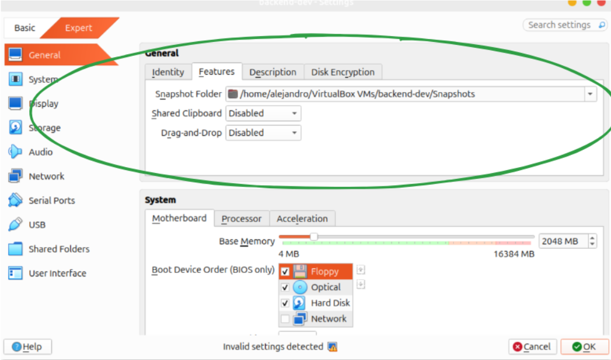
</p>

> ℹ️ **Mas informacion sobre snapshots:**
> [Snapshots en VirtualBox](https://www.notion.so/330b80eb3d8880e29f9dfebe17bb8a96)

</details>

<details>
<summary><strong>Clonar maquinas en VirtualBox</strong></summary>

Sirve para duplicar una VM ya configurada y crear entornos paralelos (testing, desarrollo o backup) sin reinstalar.

> ℹ️ **Mas informacion sobre clonacion:**
> [Clonar maquinas en VirtualBox](https://www.notion.so/330b80eb3d8880788fcede88c738506f)

</details>

<details>
<summary><strong>Como exportar maquinas de VirtualBox</strong></summary>

Muestra el flujo recomendado para exportar VMs a **OVA**, moverlas entre equipos y mantener una **copia portable** del sistema. Es ideal para **backup**, **migraciones** o **compartir entornos** sin reinstalar.

<h4 align="left">Exportar una VM a formato OVA</h4>
<table>
<tr>
<td align="left">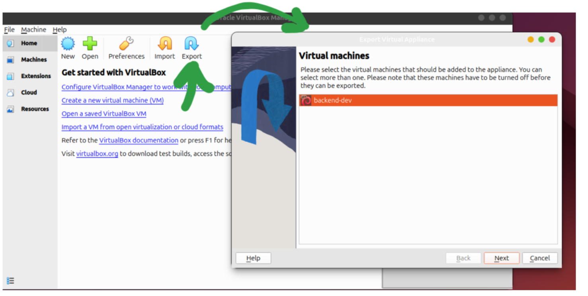</td>
<td align="left">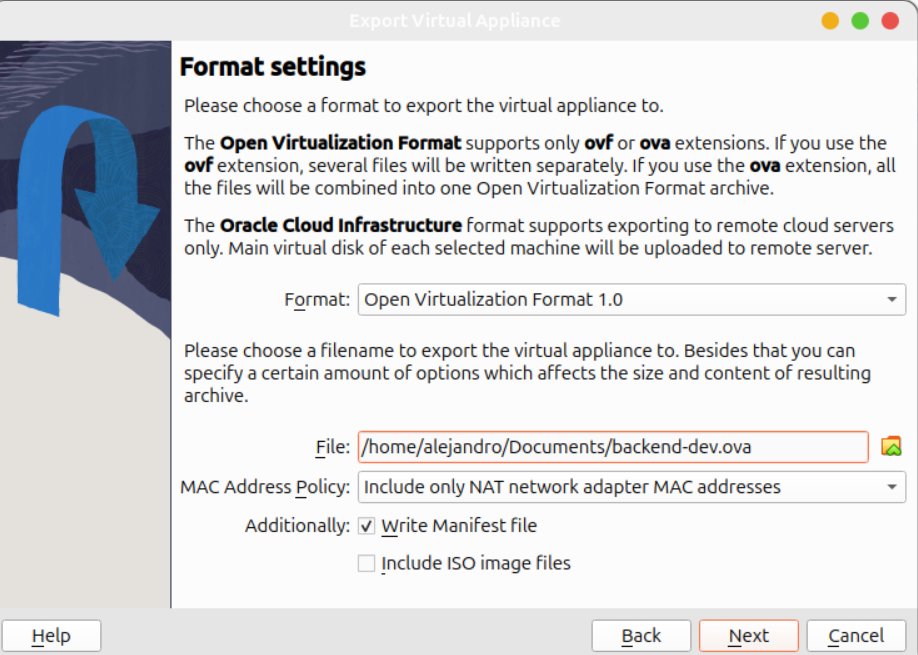</td>
</tr>
</table>

**Como importar desde la OVA**
Usa la opcion de importacion para registrar la VM en otro equipo y recrear su configuracion.

<h4 align="left">Importar una VM desde una OVA</h4>
<p align="left">
  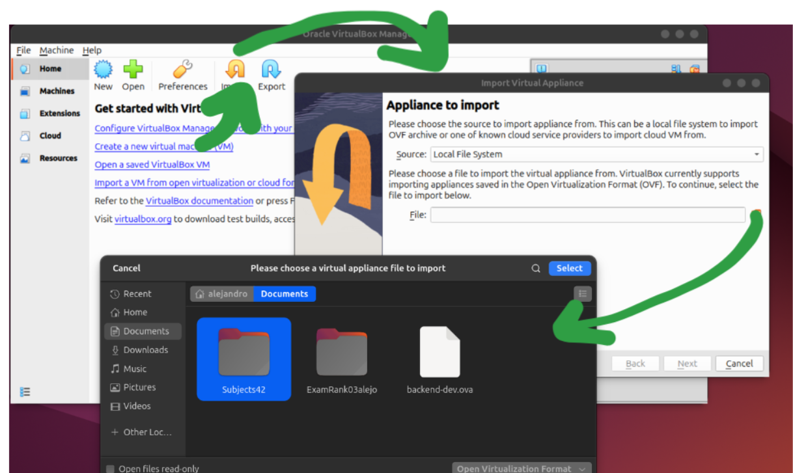
</p>

> ℹ️ **Mas informacion sobre exportar VMs:**
> [Como exportar maquinas de VirtualBox](https://www.notion.so/331b80eb3d8880a79857e346b1f8fbcd)

</details>

<details>
<summary><strong>Grupos de maquinas en VirtualBox</strong></summary>

Organiza VMs por proyecto y permite encender o apagar entornos completos de una sola vez.

<h4 align="left">Crear y gestionar grupos de VMs</h4>
<p align="left">
  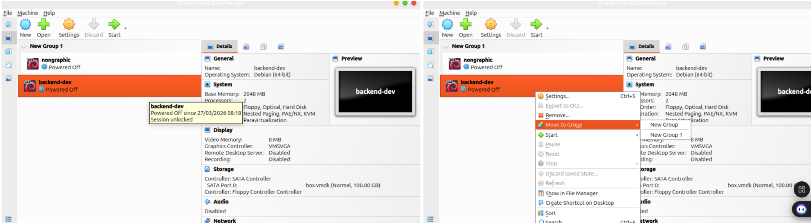
</p>

> ℹ️ **Mas informacion sobre grupos de VMs:**
> [Para que sirve crear grupos de maquinas en VirtualBox](https://www.notion.so/330b80eb3d8880c2b53cc07ab82ce3cc)

</details>

<details>
<summary><strong>Acceder a la documentacion de VirtualBox</strong></summary>

Indica como abrir la documentacion desde el propio cliente de VirtualBox y consultar recursos oficiales.

<h4 align="left">Acceso a la documentacion de VirtualBox</h4>
<p align="left">
  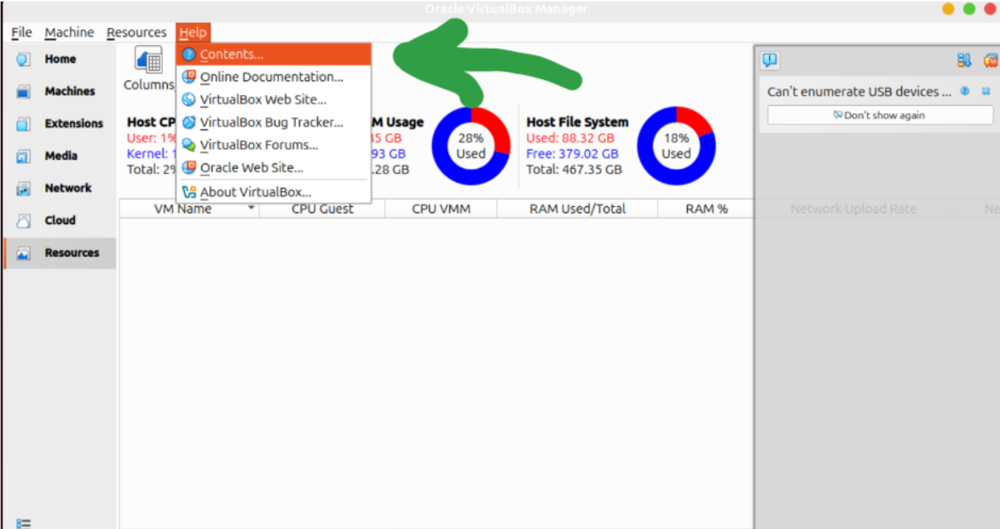
</p>

> ℹ️ **Mas informacion sobre documentacion:**
> [Acceder a la documentacion de VirtualBox](https://www.notion.so/331b80eb3d88807f9c10cfe84712a6d3)

</details>

<details>
<summary><strong>Carpetas compartidas entre VMs y host</strong></summary>

Permiten compartir archivos entre el host y la VM sin usar red o USB. Son clave para provision scripts, transferencias rapidas y desarrollo con auto-montaje.
Herramientas como **Vagrant** usan estas carpetas para inyectar scripts de provision y automatizar la creacion de VMs en local, dejando el SO configurado y listo para desplegar entornos completos (backend, laboratorios, testing y mas).

> ℹ️ **Enlace a repositorio con ejemplos de uso de carpetas compartidas en Vagrant y documentacion mas extensa:**
> [Inception (GitHub)](https://github.com/alcarril/Inception)

**Carpetas compartidas globales (todas las VMs del hipervisor)**
Se configuran para que cualquier VM pueda acceder a la misma carpeta.

<h4 align="left">Configurar una carpeta compartida global</h4>
<p align="left">
  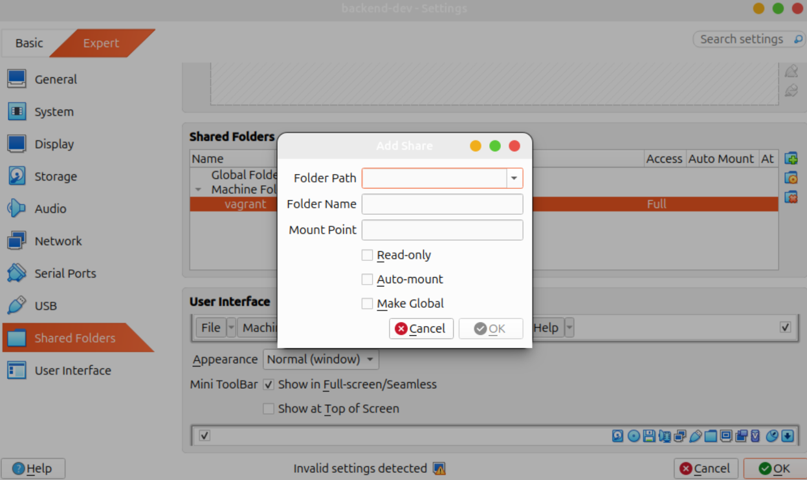
</p>

**Carpetas compartidas por maquina (solo una VM)**
Se asocian a una VM concreta para aislar acceso y permisos.

<h4 align="left">Configurar una carpeta compartida por maquina</h4>
<p align="left">
  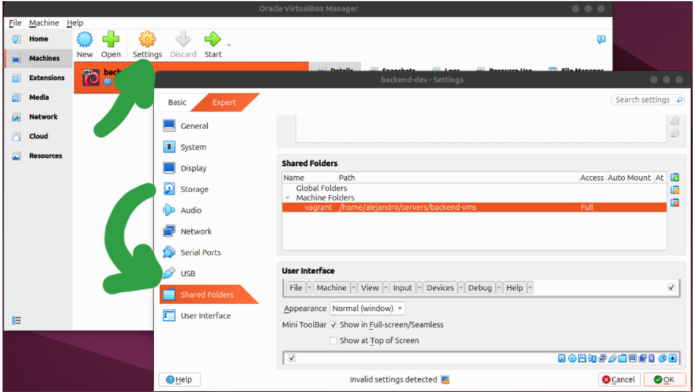
</p>

> ℹ️ **Mas informacion sobre carpetas compartidas:**
> [Crear carpetas compartidas entre VMs y sistema host](https://www.notion.so/331b80eb3d888023858fde4fd5fd3add)

</details>

<br>
<br>


>

# 🔐 Conexion segura a maquinas con SSH daemon (`sshd`)

SSH es el protocolo mas usado para administrar maquinas Linux de forma remota mediante una conexion cifrada. En Debian, el servicio que acepta conexiones SSH entrantes se llama **OpenSSH Server** y el proceso que queda escuchando en la maquina es el **SSH daemon**, normalmente `sshd`.

La idea es sencilla:

- En el **servidor** se instala y configura `sshd` para que espere conexiones.
- En el **cliente** se usa el comando `ssh` para conectarse.
- La autenticacion puede hacerse con **contrasena** o con **claves publica/privada**.

En VMs, servidores locales, sandboxes y entornos de infraestructura, SSH es una pieza base porque permite entrar a la maquina, lanzar comandos, copiar archivos y automatizar configuraciones sin usar la interfaz grafica.

---

### Instalar y activar el servidor SSH

Si durante la instalacion de Debian marcaste **SSH Server**, OpenSSH Server ya deberia estar instalado. Esta opcion aparece en la seleccion de paquetes del instalador.

<h4 align="center">Seleccion de SSH Server durante la instalacion</h4>
<p align="center">
  
</p>

Si no se marco en la instalacion, se puede instalar despues desde el propio sistema.

<details>
<summary><strong>Snippets para instalar, comprobar y activar SSH</strong></summary>

Instalar OpenSSH Server:

```bash
sudo apt update
sudo apt install openssh-server
```

Comprobar el estado del servicio:

```bash
sudo systemctl status ssh
```

Activarlo y dejarlo arrancando automaticamente:

```bash
sudo systemctl enable --now ssh
```

El servicio queda escuchando por defecto en el puerto `22/TCP`.

</details>

---


### Archivos importantes de SSH

SSH (Secure Shell) es un daemon que se configura mediante archivos de configuración tanto en el **cliente** como en el **servidor**.

<details>
<summary><strong>Archivos de configuración de SSH</strong></summary>

En el **servidor**:

```bash
/etc/ssh/sshd_config
/etc/ssh/sshd_config.d/
/etc/ssh/ssh_host_*
~/.ssh/authorized_keys
```

- `/etc/ssh/sshd_config`: configuracion principal del daemon.
- `/etc/ssh/sshd_config.d/`: configuraciones extra separadas.
- `/etc/ssh/ssh_host_*`: claves que identifican al servidor frente a los clientes.
- `~/.ssh/authorized_keys`: claves publicas autorizadas para entrar en ese usuario.

En el **cliente**:

```bash
~/.ssh/id_ed25519
~/.ssh/id_ed25519.pub
~/.ssh/known_hosts
~/.ssh/config
```

- `id_ed25519`: clave privada del cliente. No se comparte.
- `id_ed25519.pub`: clave publica. Esta si se copia al servidor.
- `known_hosts`: servidores conocidos por el cliente.
- `config`: atajos de conexion para no escribir IP, usuario, puerto o clave cada vez.

</details>

> ⚠️ Cada vez que se cambia la configuración de uno de estos archivos se tiene que reiniciar o recargar el servicio con `sudo systemctl restart ssh` o `sudo systemctl reload ssh`.

---

### Configuracion del servidor en `/etc/ssh`

La configuracion del daemon se guarda principalmente en:

```bash
/etc/ssh/sshd_config
```

En sistemas modernos tambien puede haber configuraciones separadas en:

```bash
/etc/ssh/sshd_config.d/
```

Este directorio permite crear archivos `.conf` separados para no tocar tanto el fichero principal.

> ⚠️ Desde estos archivos gestionamos el **hardening del servicio `sshd`**: que usuarios pueden entrar, si se permite `root`, si se aceptan contrasenas o claves, que puerto escucha el daemon y que metodos de autenticacion quedan habilitados.

<details>
<summary><strong>Ejemplo de hardening basico de sshd</strong></summary>

Crear un fichero separado:

```bash
sudo nano /etc/ssh/sshd_config.d/hardening.conf
```

Configuracion de ejemplo:

```sshconfig
Port 22
PermitRootLogin no
PubkeyAuthentication yes
PasswordAuthentication no
KbdInteractiveAuthentication no
AllowUsers usuario
```

- `Port 22`: puerto donde `sshd` escucha conexiones.
- `PermitRootLogin no`: evita entrar directamente como `root`.
- `PubkeyAuthentication yes`: permite autenticacion con claves SSH.
- `PasswordAuthentication no`: desactiva autenticacion por contrasena.
- `KbdInteractiveAuthentication no`: desactiva otros metodos interactivos basados en contrasena.
- `AllowUsers usuario`: limita que usuarios pueden conectarse.

Validar la configuracion antes de recargar:

```bash
sudo sshd -t
```

Si no muestra errores:

```bash
sudo systemctl reload ssh
```

> ⚠️ Si vas a desactivar contrasenas, prueba primero que puedes entrar con claves SSH desde otra terminal. Asi evitas quedarte fuera de la maquina.

</details>

---

### Autenticacion con contrasena

Es el metodo mas simple: el cliente se conecta y el servidor pide la contrasena del usuario.

> ⚠️ Este metodo obliga a interactuar manualmente con la maquina porque hay que escribir la contrasena. Sirve para laboratorios, primeras pruebas o entornos cerrados, pero **no es lo ideal para automatizar aprovisionamiento ni para servidores expuestos**.

<details>
<summary><strong>Snippets de conexion con contrasena</strong></summary>

Conexion basica:

```bash
ssh usuario@IP_DEL_SERVIDOR
```

Ejemplo:

```bash
ssh debian@192.168.1.50
```

Permitir autenticacion por contrasena en `sshd_config`:

```sshconfig
PasswordAuthentication yes
```

</details>

---

### Autenticacion con claves publica/privada

Este metodo es el mas usado para administracion real y automatizaciones. El cliente conserva una **clave privada** y el servidor guarda la **clave publica** dentro de `~/.ssh/authorized_keys`.

<details>
<summary><strong>Snippets para crear clave, copiarla y conectarse</strong></summary>

Crear una clave en el cliente:

```bash
ssh-keygen -t ed25519 -C "debian-server"
```

Copiar la clave publica al servidor:

```bash
ssh-copy-id usuario@IP_DEL_SERVIDOR
```

Conectarse usando la clave:

```bash
ssh usuario@IP_DEL_SERVIDOR
```

Tambien se puede indicar una clave concreta:

```bash
ssh -i ~/.ssh/id_ed25519 usuario@IP_DEL_SERVIDOR
```

</details>

> ⚠️ Este metodo permite automatizaciones porque no obliga a escribir la contrasena del usuario en cada conexion. Por eso se usa mucho en herramientas de aprovisionamiento y despliegue como **Vagrant**, **Ansible**, **Packer**, **cloud-init** o flujos de **IaC** donde se crea una maquina y despues se ejecutan scripts de configuracion sobre ella.

<details>
<summary><strong>Snippet de alias SSH para automatizar conexiones</strong></summary>

Ejemplo de archivo `~/.ssh/config` en el cliente:

```sshconfig
Host debian-lab
	HostName 192.168.1.50
	User debian
	Port 22
	IdentityFile ~/.ssh/id_ed25519
```

Despues puedes conectarte con:

```bash
ssh debian-lab
```

</details>

---

###  Conexiones SSH desde host a VM segun modo de red


El modo de red de VirtualBox cambia la forma de llegar al puerto SSH de la VM desde el cliente (host o exterior). Segun el modo de red, **la IP y el puerto a usar** en el comando `ssh` cambia.

| Modo de red | Como conectarse por SSH |
| --- | --- |
| **NAT** | Necesita port forwarding del host a la VM. Ejemplo: `ssh -p 2222 usuario@127.0.0.1` |
| **Bridge** | La VM tiene IP propia en la red. Ejemplo: `ssh usuario@IP_DE_LA_VM` |
| **Host-Only** | Acceso desde el host a la IP de la red Host-Only. Ejemplo: `ssh usuario@192.168.56.10` |
| **Internal Network** | Solo desde otra VM de la misma red interna, o usando un bastion/jump host. Ejemplo: `ssh -J usuario@IP_BASTION usuario@IP_VM_INTERNA` |

---

### Buenas practicas

- No permitir login directo como `root`.
- Usar claves SSH para administracion habitual.
- Desactivar contrasenas cuando las claves ya funcionen.
- Limitar usuarios con `AllowUsers`.
- Abrir el puerto SSH solo en la red necesaria.
- Validar cambios con `sudo sshd -t` antes de recargar.
- En servidores expuestos, combinar SSH con firewall, actualizaciones y revision de logs.

---

> ℹ️ **Mas informacion sobre SSH y OpenSSH Server:** Puedes leer mas detalles sobre el protocolo SSH y el servicio `sshd` en:
> [SSH y OpenSSH Server](https://broken-snowdrop-f03.notion.site/Ssh-y-Open-Ssh-server-32db80eb3d888029b02cdf35de595184)

> ℹ️ **Mas informacion sobre configuracion de OpenSSH Server:** Puedes ver opciones de configuracion y ajustes del servicio `sshd` en:
> [Servicio OpenSSH Server](https://broken-snowdrop-f03.notion.site/Servicio-Openssh-server-32db80eb3d8880a583d0e348a3b2640e?pvs=74)

---

<br>
<br>


# 🔌📺 Guia para conectarse por SSH desde VsCode


La extension **Remote - SSH** de VS Code permite abrir una sesion SSH dentro del propio editor y trabajar con el arbol de directorios, archivos y terminal de la maquina remota como si estuvieras en local. En lugar de usar la terminal para editar con `nano` o `vim`, tienes todo el IDE: resaltado de sintaxis, autocompletado, control de versiones, terminal integrada y explorador de archivos grafico apuntando al servidor remoto.

Es especialmente util en entornos de infraestructura porque puedes administrar la configuracion de varias VMs desde una sola ventana, editar archivos de configuracion (como `/etc/ssh/sshd_config` o scripts en `/usr/local/bin/`), lanzar comandos y hacer deploy sin salir del editor. Es una alternativa mucho mas agil que el SSH clasico por terminal cuando necesitas modificar varios archivos o entender la estructura del sistema de forma visual.


---

### **1. Buscar la extensión**
**Busca la extension Remote - SSH de Microsoft en el panel de extensiones de VS Code.**

<p align="center">
  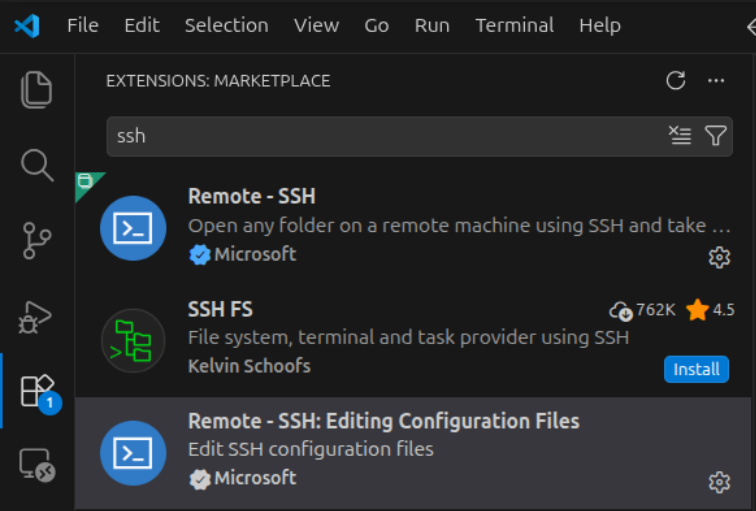
</p>

---

### **2. Instalar la extensión**
**Instala la extension y espera a que termine la descarga.**

<p align="center">
  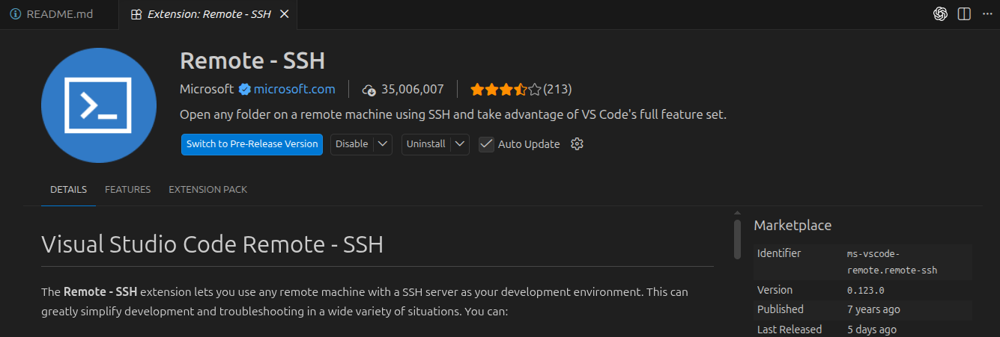
</p>

---

### **3. Abrir la paleta de conexión**
**Abre la paleta de conexion SSH desde la esquina inferior izquierda (icono verde de conexion remota).**

<p align="center">
  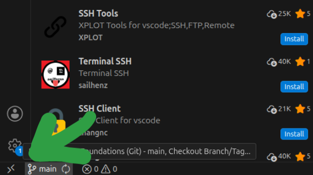
</p>

---

### **4. Menú de conexiones remotas**
**Se abre el menu de conexiones remotas. Aqui podemos anadir hosts, configurarlos, conectar con contenedores Docker y mas. Selecciona \"Add New SSH Host...\".**

<p align="center">
  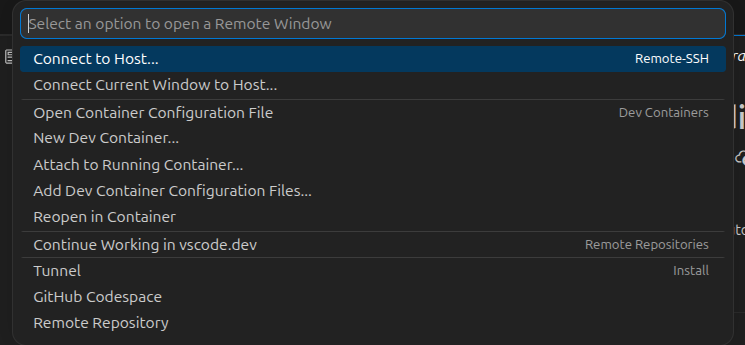
</p>

---

### **5. Añadir nuevo host SSH**
**Selecciona \"Add New SSH Host...\" para registrar una nueva conexion.**

<p align="center">
  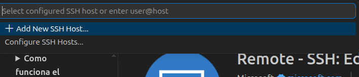
</p>

---

### **6. Configurar usuario e IP**
**Escribe el comando de conexion en formato `usuario@IP` (ej. `debian@192.168.1.50`) y confirma.**

<p align="center">
  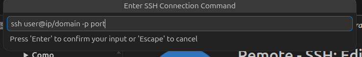
</p>

---

### **7. Elegir fichero de configuración**
**Elige el fichero de configuracion SSH donde guardar los datos del host (normalmente `~/.ssh/config`).**

<p align="center">
  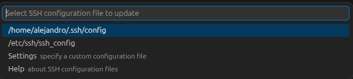
</p>

---

### **8. Host añadido**
**VS Code muestra una notificacion confirmando que el host se ha añadido. Desde este mensaje puedes iniciar la conexion directamente o abrir la configuracion del host para editarla.**

<p align="center">
  
</p>

---

### **9. Conectar al host**
**Si elegiste \"Config\" en la notificacion, se abre este menu donde puedes seleccionar \"Connect to Host...\" para iniciar la conexion.**

<p align="center">
  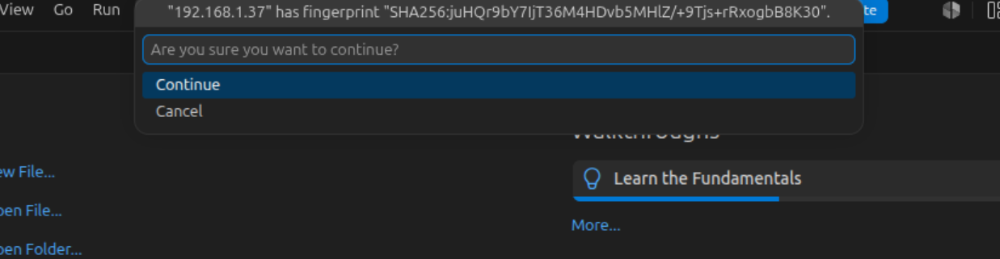
</p>

---

### **10. Entorno remoto listo**
**Tanto si conectaste desde la notificacion como desde el menu de configuracion, la ventana renderiza el arbol de directorios de la maquina remota con la barra inferior en verde, permitiendo explorar, editar y gestionar archivos con todas las capacidades del IDE.**

<p align="center">
  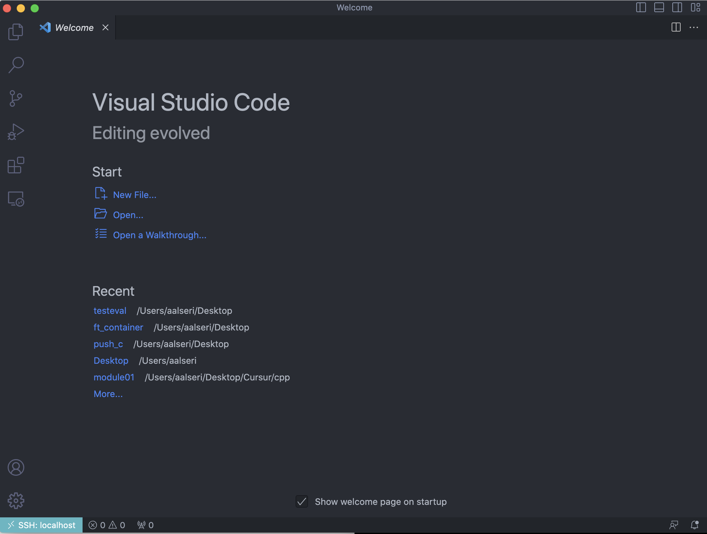
</p>

<br>
<br>


# 🤖​ Automatizacion de Infraestructura aprovisionamiento e IaC

Todo el proceso que hemos visto hasta ahora en este repositorio (crear máquinas virtuales, configurar redes y realizar la instalación de Debian paso a paso) es fundamental para entender los cimientos de la infraestructura. Sin embargo, hacerlo de forma manual en el mundo real es un proceso tedioso, lento y propenso a errores.

En entornos profesionales —ya hablemos de arquitecturas serverless, plataformas cloud, servidores host dedicados, entornos de producción distribuidos o laboratorios locales— este flujo se automatiza por completo. **Automatizar no es un lujo; es una necesidad absoluta para poder escalar y estandarizar.** Si necesitas levantar 1 o 100 máquinas para tus propios servicios o para ofrecer Infraestructura como Servicio (IaaS), hacerlo a mano es inviable.

---

### 1. La Fase de Aprovisionamiento y Configuración del Sistema

Una vez que un servidor físico o virtual se enciende por primera vez, el sistema operativo base está completamente "vacío". Para que pueda ejecutar un servicio o cumplir una función, es obligatorio configurarlo por dentro. A esta etapa se le conoce como **Aprovisionamiento** e incluye:

* Telar, instalación y actualización de paquetes y repositorios.
* Configuración de servicios esenciales (servidores web, bases de datos, etc.).
* Gestión de usuarios, claves y permisos.
* Configuración fina de red y directrices de seguridad (*hardening*).

Tradicionalmente, esto se realiza ejecutando comandos del sistema operativo directamente desde la CLI (línea de comandos).

> 🔗 **Mi repositorio recomendado:** Si quieres aprender a gestionar, administrar y exprimir un sistema por dentro desde la CLI, echa un vistazo a mi [repositorio especializado](https://github.com/alcarril/HBBSO-Docs).

En la industria existen principalmente dos maneras de abordar y estructurar este aprovisionamiento (de forma manual o automatizada mediante flujos de ejecución).

> 🔗 **Más información en Mi Notion:** [Las dos metodologías de aprovisionamiento y gestión del sistema](https://broken-snowdrop-f03.notion.site/Automatizaci-n-y-Configuraci-n-de-Entornos-con-Bash-374b80eb3d88803bb51edca3b10f02d6?pvs=74).

---

### 2. ¿Qué es IaC (Infrastructure as Code)?

Para evitar configurar decenas de servidores uno a uno a través de la CLI, nacen las herramientas de IaC (Infraestructura como Código). Estas tecnologías permiten definir mediante archivos de texto tanto la creación física/virtual de la infraestructura como la instalación y configuración del software que corre en ellas.

Podemos dividir el proceso automático en dos grandes bloques:

#### A. Creación de la Infraestructura e Instalación del SO

Las herramientas encargadas de "levantar" la máquina no son mágicas. Piensa en ellas como un lenguaje de programación de alto nivel: **igual que Python está construido sobre C y tu código se acaba parseando a ensamblador, las herramientas de IaC son *wrappers* (envoltorios)**. Su trabajo es traducir tus órdenes limpias a las APIs o lenguajes de comandos nativos de los hipervisores (`qm` en Proxmox, `VBoxManage` en VirtualBox, etc.) para crear el hardware virtual.

Para conseguir que el sistema operativo se instale solo sin que tengamos que interactuar con la pantalla, estas herramientas recurren a dos métodos:

* **Archivos de respuesta avanzada:** Uso de `preseed.cfg` (en Debian) o *Autoinstall* (en Ubuntu) para automatizar las preguntas del instalador simulando el teclado.
* **Imágenes preconfiguradas:** Uso de ISOs o plantillas modificadas que ya vienen con configuraciones básicas inyectadas de fábrica.

> 🔗 **Más información en Mi Notion:** [Cómo los Wrappers interactúan con los Hipervisores e Instalaciones Desatendidas](https://broken-snowdrop-f03.notion.site/Como-se-automatiza-y-grappea-desde-IaC-la-creacion-de-VMs-374b80eb3d88806fa414d9189d1b7806?pvs=74).

#### B. El Aprovisionamiento Automático

Para que la herramienta de IaC pueda configurar el sistema operativo una vez instalado, requiere obligatoriamente un **punto de conexión inicial**. El establecimiento de este canal de comunicación se define previamente durante la fase de instalación, ya sea mediante *preseed configs / autoinstalls* o mediante el uso de *ISOs/imágenes preinstaladas* de fábrica, dejando preparado un acceso remoto (SSH), un puerto accesible y un usuario temporal con privilegios de `sudo`.

> 🔗 **Más información en Mi Notion:** [Puntos de conexión y privilegios requeridos para el aprovisionamiento](https://broken-snowdrop-f03.notion.site/Requerimiento-minimos-para-poder-establecer-conexiones-por-en-fases-de-aprovsionamiento-despues-de-i-374b80eb3d8880bf937bdc4634f05b07).

A través de este túnel inicial, la herramienta inyecta los *provision scripts* encargados de moldear el servidor para su entorno real. A nivel profesional, esto se traduce en hitos prácticos como:

* Despliegue y puesta a punto de bases de datos (ej. PostgreSQL, Redis).
* Instalación y securización de servidores web o proxies inversos (ej. Nginx, Traefik).
* Preparación de entornos aislados de contenedores (ej. Docker, clústeres de Kubernetes).
* Automatización de políticas de copias de seguridad y monitorización de logs (ej. Promtail, agentes de Grafana).

El flujo completo exige que, una vez finalizadas estas configuraciones, se ejecute una fase de limpieza obligatoria: borrar por completo el usuario temporal de aprovisionamiento, eliminar sus scripts y revocar sus claves autorizadas para no dejar rastro ni vectores de ataque expuestos en la máquina final.

> 🔗 **Más información en Mi Notion:** [Requerimientos técnicos para el aprovisionamiento automático y scripts de inyección](https://app.notion.com/p/Como-usan-el-ssh-pressed-y-usuarion-internamente-los-IaC-para-hacer-el-provision-de-los-host-373b80eb3d888099a2a6fac7885c2f85).

---

### 3. Mapa de Herramientas de IaC

Aquí tienes el mapa visual de cómo se reparten el trabajo las herramientas más famosas de la industria, detallando qué parte del proceso automatizan y qué tecnología están abstrayendo (*wrapeando*) por debajo:

| **Tecnología** | **¿Qué hace?** | **¿Para qué sirve?** |
| --- | --- | --- |
| **Vagrant** | Levanta VMs locales automáticas usando imágenes ya hechas. | Para que los desarrolladores tengan la misma máquina que producción en su PC. |
| **Packer** | Arranca una ISO limpia y automatiza la instalación desde cero. | Para crear plantillas base de sistemas operativos (Golden Images) optimizadas. |
| **Terraform / OpenTofu** | Orquesta infraestructura declarativa guardando un archivo de estado. | Para crear y gestionar redes, discos y VMs en múltiples proveedores o nubes. |
| **Pulumi** | Orquesta infraestructura multi-proveedor usando lenguajes reales (Python, JS, Go). | Para desplegar recursos cloud con la flexibilidad de la programación tradicional. |
| **AWS CDK** | Traduce lenguajes reales a plantillas nativas de CloudFormation. | Para crear infraestructura exclusivamente en AWS con soporte nativo inmediato. |
| **Azure Bicep** | Lenguaje declarativo nativo y simplificado para Azure. | Para crear infraestructura en Azure sin lidiar con JSON ni estados externos. |
| **Ansible** | Envía configuraciones en paralelo por SSH/WinRM sin instalar agentes. | Para configurar, parchear e instalar software en servidores ya encendidos. |
| **AWS SSM** | Ejecuta scripts y parches de forma masiva a través de un agente interno. | Para gestionar y configurar flotas de VMs en AWS sin abrir puertos SSH. |
| **cloud-init** | Lee metadatos y ejecuta un script de bootstrap en el primer arranque. | Para aprovisionamiento inicial ultraligero (usuarios, llaves SSH) en nubes o VPS. |
| **Proxmox VE** | Hipervisor open-source (KVM/LXC) con API y CLI nativas. | Para montar un centro de datos virtual propio en servidores físicos locales. |
| **VMware (ESXi)** | Hipervisor corporativo tradicional basado en API robusta. | Para gestionar clusters virtuales empresariales masivos de alta disponibilidad. |

---

<br>

# TU depues de leer esto

<p align="center">
  
</p>